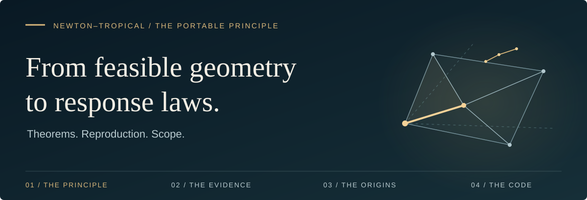

# Newton–Tropical Face Selection at Simple Polyhedral Vertices

**The portable principle** · Localize. Qualify. Scale.

This repository's central result is a **portable face-selection law for
singular asymptotics at a simple polyhedral vertex**. It turns feasible
geometry, weighted polynomial order, and active constraints into a finite
prediction of candidate leading faces and the response exponent, under
explicit local and global hypotheses.

Its geometric contribution is the passage **from an orthant balance law
to a selection law on a polyhedron**. The active constraints determine the
inward chart; that chart determines which perturbation terms survive on
each face. Qualification uses the localized problem before any response
exponent or perturbed optimizer is observed.

**Feasibility comes before degree.** In the canonical tilted-vertex
examples, an ambient-axis calculation predicts $2$. Transport through the
tangent geometry reveals the feasible quartic direction and gives $4/3$.
The principle explains that change and carries the same selection rule
across different polyhedral geometries satisfying its hypotheses.

The law is developed in the [orthant theorem](docs/FORMAL_NEWTON_TROPICAL.md),
the [polyhedral transport and selection theorem](docs/FORMAL_FACE_SELECTION.md),
and the [outcome-independent qualification refinement](docs/FORMAL_QUALIFIED_SELECTION_STRATIFICATION.md).
The [backend contract](docs/FACE_SELECTION_BACKEND.md) connects these
statements to executable calculations and their evidence.

The categorical-polytope lecture is the project's historical origin.
The Newton–tropical selection principle is its mathematical center.

[**Read the theorem ↓**](#main-theorem) · [Why it is portable](#from-an-orthant-law-to-a-polyhedral-law) · [Reproduce a result](#quick-start) · [Repository guide](#navigate-the-repository) · [Earlier theory](#earlier-categorical-and-optimization-theory-encoded)

---

## Main theorem

Let $P$ be a bounded full-dimensional polyhedron. Let $F,G$ be continuous
on $P$ and real analytic near a simple vertex $v$ that uniquely maximizes
the base objective $F$. In inward edge coordinates,

$$
\Phi(c)=v+\sum_i c_i u_i,\qquad c_i\ge0,
$$

define $D(c)=F(v)-F(\Phi(c))$ and $R(c)=G(\Phi(c))-G(v)$.
Assume the base has the diagonal weighted principal part

$$
D_0(c)=\sum_i A_i c_i^{\beta_i},\qquad A_i\gt0,\quad\beta_i\gt1,
$$

with the [stated uniform remainders](docs/FORMAL_FACE_SELECTION.md#4-hypotheses-with-uniform-remainders),
and that $R$ is polynomial.

Weight $c_i$ by $w_i=1/\beta_i$. A monomial $c^\alpha$ then has degree

$$
\deg_w(c^\alpha)=\sum_i\frac{\alpha_i}{\beta_i}.
$$

Combine like monomials, restrict to each feasible tangent-cone face, and
take its first **nonzero** weighted layer. A face qualifies when its degree
$q_S$ lies in $(0,1)$ and its initial form has a positive relative-interior
witness. These tests use local data, not an observed response exponent.

If qualified faces exist, set $q_\ast=\min_{S\text{ qualified}}q_S$ and verify
the local positive-gain envelope

$$
\max(R(c),0)\le K D_0(c)^{q_\ast}
$$

for some finite $K$. Then the polyhedral theorem gives

$$
\boxed{
M(s)-F(v)-sG(v)=\Theta(s^\gamma),\qquad
\gamma=\frac1{1-q_\ast},\qquad s\downarrow0,}
$$

Here $M(s)=\max_{x\in P}(F(x)+sG(x))$; write
$\Delta(s)=M(s)-F(v)-sG(v)$ for the centered gain.

Nonnegative combined coefficients supply the upper envelope automatically
when a qualified minimum exists. Signed polynomials may need additional
control near zeros of a non-positive initial form. Winning faces describe
candidate **leading channels**; exact optimizer support and sharp
coefficients require the corresponding reduced analysis.

[Full theorem and proof →](docs/FORMAL_FACE_SELECTION.md) · [Sharp orthant constants →](docs/FORMAL_NEWTON_TROPICAL.md)

## The three-layer selection principle

The theorem and backend share one end-to-end architecture:

1. **[Localization](docs/FORMAL_FACE_SELECTION.md#2-global-isolation):** replace
   the original global polyhedron by the tangent cone at a simple
   base-maximizing vertex fixed independently of the perturbed optimizer.
2. **[Selection](docs/FORMAL_FACE_SELECTION.md#5-faces-and-admissibility-defined-from-the-data-alone):**
   transport the perturbation into the feasible edge chart, restrict it to
   cone faces, and rank admissible faces by exact weighted degree.
3. **[Scaling](docs/FORMAL_FACE_SELECTION.md#8-selection-qualified):** convert the
   winning degree into the response exponent `gamma = 1 / (1 - q_star)`.

This single hierarchy:

- organizes the theory around [one local geometric object](docs/FORMAL_FACE_SELECTION.md#1-setup);
- [explains the mechanism](docs/FACE_SELECTION_BACKEND.md#mechanism-explanation) rather than merely fitting an exponent;
- [predicts the exponent before numerical measurement](docs/FORMAL_FACE_SELECTION.md#5-faces-and-admissibility-defined-from-the-data-alone);
- filters irrelevant directions [without deleting their audit trail](docs/FORMAL_AMBIENT_FACE_TRANSPORT.md#provenance-cancellation-and-suppression);
- classifies perturbations as [relevant, critical, subleading, or inactive](docs/FACE_SELECTION_BACKEND.md#term-level-perturbation-classification);
- identifies the [constraints defining candidate leading channels](docs/FACE_SELECTION_BACKEND.md#mechanism-explanation);
- identifies [cancellation and geometric suppression](docs/FORMAL_AMBIENT_FACE_TRANSPORT.md#provenance-cancellation-and-suppression) independently;
- groups perturbations into [universality classes](docs/FACE_SELECTION_BACKEND.md#universality-classes); and
- generalizes from one example to [finite families](docs/FORMAL_EXPONENT_DISCOVERY_ENGINE.md#principle), [portfolios](docs/FACE_SELECTION_BACKEND.md#portfolio-comparison), and [parametric phase diagrams](docs/FORMAL_FACE_SELECTION_PHASE_FAN.md#theorem-v17--universality-phase-fan).

The [theorem hypotheses](#main-theorem) justify the local reduction and
response law. The [backend scope](docs/FACE_SELECTION_BACKEND.md#face-selection-status-semantics)
records what each operation has checked; [finite-scale accuracy](docs/CURVED_FINITE_SCALE.md)
requires its own bounds.

### From an orthant law to a polyhedral law

The orthant law starts with feasible coordinates, base orders, and a
perturbation polynomial already supplied. A polyhedral problem must first
determine those coordinates and identify which directions its constraints
actually permit.

At a simple vertex, the inward edge generators are linearly independent.
Their linear map identifies the nonnegative orthant with the tangent cone;
the translated chart $\Phi$ parametrizes the feasible set locally. Every
cone face corresponds to a subset of released edge coordinates. Pulling
the objectives through that chart therefore supplies both the Newton data
and the feasible faces on which the balance can occur.

This is the portability mechanism: **the geometry supplies the coordinates
in which the same weighted selection rule applies**. The base vertex,
face restrictions, and positivity tests are determined before the perturbed
optimizer is known. Positive edge rescaling preserves weighted support and
the selected exponent. The formulation requires a simple vertex and the
stated principal-part, remainder, isolation, and gain-envelope conditions;
other tangent cones need an extension.

### The decisive example: feasibility comes before degree

At the simplex vertex $v=(0,1)$, take

$$
\begin{aligned}
P&=\lbrace x_0,x_1\ge0:x_0+x_1\le1\rbrace,\cr
F(x)&=-((x_0+x_1-1)^2+x_0^4),\qquad G(x)=x_0.
\end{aligned}
$$

The ambient direction $(1,0)$ violates the tangent condition
$d_0+d_1\le0$. Probing along it sees quadratic base decay and suggests
an exponent of $2$.

The active constraints instead give the inward generators
$u_0=(1,-1)$ and $u_1=(0,-1)$, hence

$$
\Phi(c_0,c_1)=(c_0,1-c_0-c_1),\qquad
D(c)=c_0^4+c_1^2,\qquad R(c)=c_0.
$$

The feasible perturbation has degree $q_\ast=1/4$, so the response exponent
is $4/3$. Setting $c_1=0$ reduces the gain to $-c_0^4+s c_0$ and gives
the exact optimum:

$$
c_0=(s/4)^{1/3},\qquad c_1=0,\qquad
\Delta(s)=\frac{3}{4^{4/3}}s^{4/3},\qquad 0\lt s\le4.
$$

The sheared simplex has different edge generators and the same transported
base and perturbation. Both examples are recorded in
[V.20](docs/FORMAL_AMBIENT_FACE_TRANSPORT.md#the-two-canonical-counterexamples).
They expose the structural obstruction: **ambient degree becomes relevant
to the constrained law only after transport through the feasible geometry**.

<details>
<summary><strong>Read the exact chart construction</strong> · constraints, pullbacks, and provenance</summary>

For the independent active constraints $A_Sx=b_S$, solve

$$
A_Sv=b_S,\qquad A_Su_i=-e_i.
$$

The generator map is linear and the translated chart $\Phi$ is affine.
The [compiler](categorical_polytope/ambient_face_compiler.py) records the
pullback of every ambient term, including cancellation and geometric
suppression. Its rational arithmetic preserves the edge identities used
to derive the Newton data.

</details>

### What the minimum over faces means

Selection compares the first **nonzero, qualified face layers** after
transport, restriction, and combination of like monomials. A negative
initial layer cannot be skipped to reach a later positive one. A cancelled
layer is absent from the combined polynomial.

This distinction explains how the mechanism can change:

- A coefficient can change the leading amplitude while leaving the
  qualified weighted degree unchanged.
- A coefficient crossing zero can remove a mechanism or expose a new layer,
  even when no degree laws cross.
- A term can vanish because of a face restriction, or cancel against another
  term with the same signature; the record distinguishes these causes.
- Several faces can inherit the same lowest degree. Winning faces identify
  candidate leading channels; exact optimizer support needs the reduced
  and sometimes subleading analysis.

The resulting records support comparisons of exponent and mechanism classes
across finite perturbation families. Supplied parameter laws then turn the
same qualification and comparison steps into phase and cancellation walls.

<details>
<summary><strong>What changes across a parameter wall</strong> · qualification before comparison</summary>

For supplied affine degrees and coefficients,

$$
q_j(\theta)=a_j+b_j\theta,\qquad
c_j(\theta)=u_j+v_j\theta,
$$

the possible walls are

$$
q_i=q_j,\qquad q_i=0,\qquad q_i=1,\qquad c_i=0.
$$

Winning identities stay fixed between these walls; the value of
$\gamma(\theta)=1/(1-q_\ast(\theta))$ can still vary inside a chamber.
The implementation solves exact **one-parameter** affine diagrams. The
multi-parameter theorem is expressed through hyperplane arrangements.
Its robustness margin measures distance to a change in winning identities,
not finite-scale accuracy.

[V.17 phase theorem →](docs/FORMAL_FACE_SELECTION_PHASE_FAN.md) · [V.18 qualification →](docs/FORMAL_QUALIFIED_SELECTION_STRATIFICATION.md)

</details>

### Read the scope before using a prediction

| Operation or evidence | What it establishes | Limit to retain |
| :--- | :--- | :--- |
| General face selector | Localized prediction with exact polynomial refinement where supported | Analytic admission still uses numerical hypothesis probes |
| Affine phase operation | Exact walls and selection for supplied mechanisms | Analytic flags are caller attestations; the full objective and positive-gain envelope are not independently proved |
| V.22 curved reduction | Exact checks for a supported two-dimensional polynomial family | Its separate scope does not cover every curved channel |
| Finite-scale certificate | Rational response bounds and an accuracy decision at a requested scale | This decision is separate from the asymptotic license |
| Discovery and portfolios | Classification and comparison of a finite supplied family | A completed screen is not exhaustive over all perturbations or a claim of literature novelty |

The [backend guide](docs/FACE_SELECTION_BACKEND.md) defines each status and
evidence field. It also distinguishes the numerical inverse face-matching
block from exact forward refinement.

### The signed-channel boundary

The [mathematical audit](docs/MATHEMATICAL_AUDIT.md) gives a decisive example:

$$
D_0=x^6+y^6,\qquad R=-x^2+xy^2
=\frac{y^4}{4}-\left(x-\frac{y^2}{2}\right)^2.
$$

The original selector has no qualified coordinate face, yet
$\Delta(s)\sim s^3/432$. Its v8 guard retains the unresolved higher layer.
The explicitly requested [V.22 operation](docs/FORMAL_CURVED_REDUCTION.md)
resolves this example by quadratic elimination.

For coefficients near cancellation, use the
[finite-scale contract](docs/CURVED_FINITE_SCALE.md) to distinguish
asymptotic validity from requested accuracy. The
[activation/contact research note](docs/RESEARCH_ACTIVATION_CONTACT_LAW.md)
and its [exact algebra script](experiments/activation_contact_check.py)
study a further boundary; that classification is not a backend operation.

## Completed mathematical and computational contributions

| Result | Read it for | Executable connection |
| :--- | :--- | :--- |
| [V.1–V.14 · vertex-threshold series](docs/FORMAL_VERTEX_THRESHOLD.md) | Displacement, gap exponents, anisotropic balances, and failure regimes | [`vertex_threshold.py`](categorical_polytope/vertex_threshold.py) |
| [V.15–V.16 · orthant law](docs/FORMAL_NEWTON_TROPICAL.md) | Sharp single-axis constants and selection by the lowest positive weighted layer | [`newton_tropical.py`](categorical_polytope/newton_tropical.py) |
| [Polyhedral face-selection theorem](docs/FORMAL_FACE_SELECTION.md) | Feasible transport, independent qualification, and the conditional gap law | [Core codification](docs/FACE_SELECTION_CODIFICATION.md) |
| [V.17](docs/FORMAL_FACE_SELECTION_PHASE_FAN.md) / [V.18](docs/FORMAL_QUALIFIED_SELECTION_STRATIFICATION.md) | Affine degree walls and coefficient-qualification strata | [`face_selection_phase.py`](categorical_polytope/face_selection_phase.py) |
| [V.19 · positivity witness](docs/FORMAL_BINOMIAL_POSITIVITY_WITNESS.md) | Constructive relative-interior positivity for distinct-signature binomials | [Saved request](experiments/face_selection_binomial_v19_request.json) |
| [V.20 · ambient transport](docs/FORMAL_AMBIENT_FACE_TRANSPORT.md) | Exact chart reconstruction, pullbacks, provenance, and suppression | [`ambient_face_compiler.py`](categorical_polytope/ambient_face_compiler.py) |
| [V.21 · finite discovery](docs/FORMAL_EXPONENT_DISCOVERY_ENGINE.md) | Finite exponent spectra, mechanism classes, and registry-relative candidates | [Saved request](experiments/face_selection_discovery_v21_request.json) |
| [V.22 · curved reduction](docs/FORMAL_CURVED_REDUCTION.md) | A supported signed family, sharp coefficients, and reduced-layer cancellation | [Reduction implementation](categorical_polytope/curved_reduction.py) |
| [Finite-scale accuracy](docs/CURVED_FINITE_SCALE.md) | Certified objective intervals and tolerance decisions | [Rational bounds](categorical_polytope/curved_finite_scale.py) |
| [Backend contract](docs/FACE_SELECTION_BACKEND.md) | Python/JSON integration, operations, scope, and version map | [Public boundary](categorical_polytope/adjudication/polyhedra/backend.py) |

V.15 is the sharp-constant result; V.16 is the orthant selection result.
The polyhedral theorem supplies its own geometric and analytic conditions.
Formal result numbers, the current asset `portable-principle.v8`, and JSON
schema versions identify different things.

---

## Navigate the repository

| If you want to… | Start with | Then follow |
| :--- | :--- | :--- |
| Understand the central law | [Orthant theorem · V.15–V.16](docs/FORMAL_NEWTON_TROPICAL.md) | [Polyhedral selection](docs/FORMAL_FACE_SELECTION.md) → [Qualification · V.18](docs/FORMAL_QUALIFIED_SELECTION_STRATIFICATION.md) |
| Reproduce a claimed result | [Runbook](docs/RUNBOOK.md) | Saved requests, expected outcomes, and preserved evidence |
| Integrate the backend | [Python and JSON contract](docs/FACE_SELECTION_BACKEND.md) | [Backend implementation](categorical_polytope/adjudication/polyhedra/backend.py) |
| Understand a refusal or curved channel | [Mathematical audit](docs/MATHEMATICAL_AUDIT.md) | [V.22 reduction](docs/FORMAL_CURVED_REDUCTION.md) → [Finite-scale accuracy](docs/CURVED_FINITE_SCALE.md) |
| Trace the original categorical project | [Corrected short note](docs/SHORT_NOTE.md) | [Master overview](categorical_polytope/Overview.md) → [Corrected proofs](docs/FORMAL_THEOREMS.md) |
| Inspect empirical and generated evidence | [Verification corpus](docs/VERIFICATION_CERTIFICATE.md) | [Campaign protocol](docs/CAMPAIGN.md) and [coverage audit](docs/COVERAGE_PROOF_AUDIT.md) |
| Find a module or experiment | [Code map](#layout) | [Package](categorical_polytope/), [experiments](experiments/), and [tests](tests/) |

**A useful first pass:** read the orthant and polyhedral statements, run one
saved transport example, inspect its scope, then open the signed
counterexample. The [runbook](docs/RUNBOOK.md) connects those steps.

---

## Quick start

Run commands from the **repository root**, the directory containing
`pyproject.toml`. Python **3.10 or newer** is required. The core backend and
canonical reproduction runner use the standard library and local package;
they need no model API key.

```bash
python experiments/reproduce_principle.py
```

The runner creates a fresh evidence directory under
`tmp/principle-reproduction/`. It preserves requests, complete responses,
explicit checks, and source hashes. Its current cases cover transport,
positivity, phase and qualification walls, discovery, curved reduction,
finite-scale accuracy, inverse matching, expected refusals, exact research
checks, and documentation rendering.

For one public backend example:

```bash
python -m categorical_polytope.adjudication.polyhedra.backend --input experiments/face_selection_ambient_v20_request.json --pretty
```

The two-geometry portfolio returns `face-weight:1/4|response:4/3` for both
cases while recording a change in the feasible chart.
[Inspect the expected evidence →](docs/RUNBOOK.md#exact-feasible-chart-transport--v20)

<details>
<summary><strong>Use the Python interface</strong> · the same public boundary</summary>

```python
from categorical_polytope import analyze_face_selection

result = analyze_face_selection({
    "request_id": "tilted-simplex",
    "system": "([[-1,0],[0,-1],[1,1]], [0,0,1])",
    "base": "-((x0+x1-1)**2 + x0**4)",
    "perturbation": "x0",
    "observed_exponent": 4 / 3,
})

assert result["selection"]["weighted_degree"] == 0.25
assert abs(result["scaling"]["response_exponent"] - 4 / 3) < 1e-9
print(result["status"], result["scope"])
```

For a reusable process, batches, operation aliases, and response fields,
read the [backend contract](docs/FACE_SELECTION_BACKEND.md).

</details>

### Requirements and optional tools

| Work | Requirement |
| :--- | :--- |
| Core backend and canonical reproductions | Python 3.10+; standard library |
| Regression suite | `pytest` |
| Figures and notebook work | Optional plotting/notebook dependencies |
| Installed CLI entry points | Optional editable package installation |
| Model-generated candidate campaigns | A configured provider, accessible model, and credentials |

```bash
python -m pip install -e ".[dev]"
python -m pytest -q -p no:cacheprovider
```

The editable installation also provides `categorical-face-selection`.
The [runbook](docs/RUNBOOK.md) separates lightweight checks from older
experiment commands that regenerate tracked reports. Test counts and
finite numerical results are recorded with evidence rather than treated as
permanent repository guarantees.

---

## Earlier categorical and optimization theory (encoded)

This is a second reading route through the repository: the original
categorical motivation, the **corrected optimization statements**, and the
demonstrations that encode those ideas. “Encoded” means that an implementation
or example exists; it does not give every legacy certificate label the force
of a theorem.

### Historical origin: the categorical-polytope lecture

The lecture starts from cartesian closure and the obstruction to a
coexponential left adjoint of coproduct in `Set`. It motivates operational
optimization analogies. A Cartesian parameter block, a polyhedral vertex,
and a categorical coproduct remain different mathematical objects.

| Reading route | Purpose |
| :--- | :--- |
| [Short note](docs/SHORT_NOTE.md) | Concise corrected presentation |
| [Master overview](categorical_polytope/Overview.md) | Conceptual narrative and diagrams |
| [Corrected formal theorems](docs/FORMAL_THEOREMS.md) | The precise hypotheses and proofs |
| [Expanded manuscript](docs/PAPER_DRAFT.md) / [paper outline](docs/PAPER_OUTLINE.md) | Longer development and publication structure |
| [Original-note revision record](docs/ORIGINAL_NOTE_REVIEW.md) | Counterexamples to superseded claims and the reasons for correction |

### What the corrected statements say

| Topic | Statement to use | Implementation or proof |
| :--- | :--- | :--- |
| Cartesian closure | $\mathrm{Hom}(A\times X,Y)\cong\mathrm{Hom}(X,Y^A)$; the finite-set example exhibits currying | [`cartesian_closed.py`](categorical_polytope/cartesian_closed.py) |
| Coexponential obstruction | For nonempty $A,Y$, no $L$ represents $\mathrm{Hom}(Y,A\sqcup-)$ on all sets; the empty cases are treated separately | [Proof and exceptions](docs/FORMAL_THEOREMS.md#0-the-categorical-obstruction-and-the-analogy), [finite-set code](categorical_polytope/set_category.py) |
| Box vertex localization | A continuous, **separately quasiconvex full objective** on a compact box has at least one maximizing vertex | [Theorem 1](docs/FORMAL_THEOREMS.md#theorem-1--vertex-localization) |
| Quadratic residual and separation | Positive definiteness, residual information, and curvature-normalized coupling supply the stated objective-gap bounds | [Theorem 2](docs/FORMAL_THEOREMS.md#theorem-2--quadratic-residual-and-separation-bounds) |
| Candidate search | A feasible candidate is certified using a proved upper bound for the **same objective and feasible set** | [Theorem 3](docs/FORMAL_THEOREMS.md#theorem-3--a-certified-finite-candidate-search) |

For example, for $Q(\theta)=c^\top\theta-\tfrac12\theta^\top F\theta$ with
$F=F^\top\succ0$, let $r_z=c-Fz$. If
$0\lt\mu\le\lambda_{\min}(F)$ is independently established, then

$$
Q(F^{-1}c)-Q(z)
=\frac12r_z^\top F^{-1}r_z
\le\frac{\|r_z\|_2^2}{2\mu}.
$$

The historical $\Phi(\varepsilon)$ in
[`formal_bounds.py`](categorical_polytope/formal_bounds.py) is retained for
reproduction. It is **not a universal separability bound**. Small
off-diagonal leakage alone does not supply a scale-free objective-gap
certificate, and a local empirical Fisher matrix does not by itself give
a global nonlinear bound.

### Find the encoded demonstrations

| Area | Files | How to interpret them |
| :--- | :--- | :--- |
| Conceptual polytope and parameter box | [Conceptual model](categorical_polytope/conceptual_polytope.py), [box objective](categorical_polytope/hypersurface_box.py) | Models and a specific default objective; general guarantees require the corrected full-objective hypotheses |
| Componentwise and vertex probes | [Adversarial probe](categorical_polytope/adversarial_probe.py), [vertex probe](categorical_polytope/vertex_probe.py), [pruned search](categorical_polytope/fisher_pruned_search.py) | Candidate construction and legacy diagnostics; a certificate must be justified for the actual objective |
| Fisher and decomposition diagnostics | [Factorization](categorical_polytope/fisher_factorization.py), [bridge](categorical_polytope/bridge_fisher_adversarial.py), [stability](categorical_polytope/decomposition_stability.py), [legacy comparisons](categorical_polytope/formal_bounds.py) | Coupling measurements and comparison quantities; use Theorem 2 for corrected bounds |
| Nonlinear examples | [Nonlinear objective](categorical_polytope/nonlinear_objective.py) | Empirical comparisons, without an automatic global Fisher certificate |
| Operational substitutes and manifest | [Substitute](categorical_polytope/extremal_substitute.py), [original deliverables](categorical_polytope/firsts.py) | Historical organization and demonstrations, not constructions of the missing adjoint |

<details>
<summary><strong>Neighboring vertices from the lecture</strong> · illustrative categorical constructions</summary>

The [neighboring-vertices module](categorical_polytope/neighboring_vertices.py)
contains small constructions and comparisons:

| Motif | What the example explores |
| :--- | :--- |
| Monoidal structure | Tensor/cardinality comparisons; these alone do not establish a closed structure for coproduct on `Set` |
| Chu / Dialectica | Toy relational and predicate-pair duality |
| Continuations | Splitting maps from a disjoint union into maps from its two summands |
| Coalgebra / comonad | Observation and duplication motifs |

These examples do not prove that every listed structure exists with all its
categorical laws in the modeled setting, and they do not restore the missing
coexponential. The [corrected obstruction](docs/FORMAL_THEOREMS.md#0-the-categorical-obstruction-and-the-analogy)
is the reference statement.

</details>

<details>
<summary><strong>Run the corrected examples or revisit the lecture</strong> · separate entry points</summary>

For the corrected rational optimization examples:

```bash
python experiments/note_publication_check.py
```

To inspect the historical manifest or run the original
[lecture CLI](categorical_polytope/__main__.py):

```bash
python -m categorical_polytope firsts
python -m categorical_polytope
```

Run these from the repository root. Interpret legacy summaries and
certificate labels through the [revision record](docs/ORIGINAL_NOTE_REVIEW.md).
The [historical reproduction route](docs/RUNBOOK.md#historical-demos-and-paper-materials)
explains the older experiments and their generated reports.

</details>

---

## Layout

The earlier modules are indexed above. This map locates the main research
and execution paths.

| Location | Responsibility |
| :--- | :--- |
| [`docs/`](docs/) | Theorem statements, proofs, contracts, audits, and research notes |
| [`categorical_polytope/face_selection.py`](categorical_polytope/face_selection.py) | Face restrictions, qualification, rational weights, and conditional selection |
| [`categorical_polytope/ambient_face_compiler.py`](categorical_polytope/ambient_face_compiler.py) | Exact ambient polynomial pullbacks and term provenance |
| [`categorical_polytope/face_selection_phase.py`](categorical_polytope/face_selection_phase.py) | Exact affine phase and qualification calculations |
| [`categorical_polytope/curved_reduction.py`](categorical_polytope/curved_reduction.py) / [`curved_finite_scale.py`](categorical_polytope/curved_finite_scale.py) | Supported curved channels and rational finite-scale bounds |
| [`categorical_polytope/adjudication/`](categorical_polytope/adjudication/) | Domain-specific local adjudication and backend interfaces |
| [`experiments/`](experiments/) | Saved requests, reproduction scripts, and campaign entry points |
| [`tests/`](tests/) | Regression tests and executable examples |
| [`tmp/`](docs/RUNBOOK.md#one-command-reproduction) | Ignored local evidence directories created by the reproduction runner |

<details>
<summary><strong>Research and candidate-generation routes</strong> · optional workflows</summary>

| Work | Entry point |
| :--- | :--- |
| Interaction and base screening | [`interaction_search.py`](categorical_polytope/interaction_search.py), [`base_search.py`](categorical_polytope/base_search.py) |
| Candidate campaigns and budgets | [Campaign protocol](docs/CAMPAIGN.md) |
| Provider configuration and presets | [Configuration notes](docs/RESEARCH_DIRECTIONS.md), [preset implementation](categorical_polytope/loop_closure.py) |
| Code-property campaigns | [Code properties](docs/CODE_PROPERTIES.md) |
| Additional research sketches | [Research directions](docs/RESEARCH_DIRECTIONS.md), [discoveries](docs/RESEARCH_DISCOVERIES.md), [formal research notes](docs/FORMAL_RESEARCH_PROOFS.md) |

Model APIs generate candidate data; the local code parses and adjudicates it.
They are optional for reproducing the saved examples. For live runs, choose
a model and endpoint your account can access and check the campaign's output
requirements. Preset availability and provider behavior are configuration
details, not mathematical assumptions.

Research sketches and campaign reports retain their stated evidence levels;
they are not blanket extensions of the current selection theorem.

</details>

## Applications & conditional design warnings

The evaluation material applies optimization ideas to evaluation design.
It does not report measurements of a deployed system.

| Document | Read it for |
| :--- | :--- |
| [Safety capacity](docs/SAFETY_CAPACITY.md) | Conditional links between the V-theorems and evaluation design |
| [Recommendations](docs/EVAL_DESIGN_RECOMMENDATIONS.md) / [checklist](docs/EVAL_DESIGN_CHECKLIST.md) | Pointwise, distributional, geometric, and margin-based claims |
| [Distributional audit](docs/DISTRIBUTIONAL_COVERAGE_AUDIT.md) | Detection bounds and their calibration/transfer assumptions |
| [Candidate coverage certificate](docs/CANDIDATE_COVERAGE_CERTIFICATE.md) | Candidate-space representation and covering radius |
| [Coverage correlation](docs/COVERAGE_CORRELATION.md) | Recorded coverage and escape-search comparisons |
| [Verification corpus](docs/VERIFICATION_CERTIFICATE.md) | Checkpointed evidence, denominators, and counterexample status |

## Publication control

Before publishing Markdown, run the repository's catalogue of observed
GitHub math bugs:

```bash
python experiments/ghmath.py README.md docs categorical_polytope experiments
```

[`ghmath.py`](experiments/ghmath.py) checks delimiters, unsupported macros,
escaping, and indented display blocks. It is also the reproduction suite's
`docs-rendering` case. Passing it does not prove the mathematics or replace
visual inspection. [Rendering limits →](docs/RUNBOOK.md#document-rendering)

The [principle-document revision record](docs/PRINCIPLE_DOCUMENTATION_REVIEW.md)
and [original-note revision record](docs/ORIGINAL_NOTE_REVIEW.md) explain
substantive corrections. Mathematical scope is part of the publication.

---

[**Return to the navigation guide ↑**](#navigate-the-repository) · [Reproduction runbook](docs/RUNBOOK.md) · [Backend contract](docs/FACE_SELECTION_BACKEND.md)
