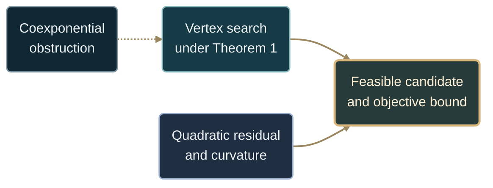

# Overview — Fisher-controlled extremal probes

**Brisen Koch · Illustrated companion · Corrected edition, 7 September 2026**

A guide to the categorical motivation, three proved optimization guarantees,
their reproducible examples, and the implementation boundary. The short note
gives the argument in compact form; this page shows how its parts fit together.

[**Read the short note →**](../docs/SHORT_NOTE.md) · [Full proofs](../docs/FORMAL_THEOREMS.md) · [Revision record](../docs/ORIGINAL_NOTE_REVIEW.md) · [The project today](../README.md)

| 01 · The idea | 02 · The construction | 03 · The evidence | 04 · The documents |
| :--- | :--- | :--- | :--- |
| [Conceptual map](#conceptual-map) | [Three guarantees](#theorem-1--vertex-localization) | [Exact examples](#experiments-and-figures) | [Publication materials](#publication-checklist) |

<details>
<summary><strong>Run the corrected examples</strong> · standard library only</summary>

From the repository root:

```bash
python experiments/note_publication_check.py
```

The [reproduction script](../experiments/note_publication_check.py) evaluates
the displayed examples and their certificates in rational arithmetic.
The broader historical demos remain available with
`python -m categorical_polytope`; their legacy certificate fields have the
scope described [below](#implementation-and-certificate-scope).

</details>

---

<sub>01 / THE IDEA</sub>

## Conceptual map

The original question was categorical: what can be done when the desired
coexponential adjunction is absent? The operational answer has three parts:
find admissible candidates, evaluate them, and prove a bound on what remains
unachieved.



The dashed connection expresses motivation. The optimization guarantees come
from the stated hypotheses, not from the categorical analogy alone.

<details>
<summary><strong>Read the categorical correspondences</strong></summary>

| Categorical background | Meaning in this toolkit |
| :--- | :--- |
| For nonempty $A$, $A\sqcup-$ has no left adjoint in `Set` | Motivation for an operational candidate-selection procedure |
| The product–exponential adjunction does exist | Categorical background, without an identification with numerical box corners |
| Parameter blocks | A Cartesian product of feasible sets when constraints are independent |
| Geometric vertices | Extreme points of the actual feasible set |
| Off-diagonal quadratic terms | Model coupling, which must be assessed together with curvature |

The elementary obstruction and its empty-set exceptions are proved in
[Section 0 of the proof source](../docs/FORMAL_THEOREMS.md#0-the-categorical-obstruction-and-the-analogy).

</details>

**Follow the argument:** [Where to search](#theorem-1--vertex-localization) → [What separation costs](#theorem-2--separable-near-optimality) → [How to certify the candidate](#theorem-3--constructive-probe)

---

<sub>02 / THE CONSTRUCTION</sub>

## Theorem 1 — Vertex localization

**Assumptions.** $H$ is a nonempty compact box. The continuous **full
objective** $C$ is quasiconvex on every coordinate slice.

**Conclusion.** At least one global maximizer is a vertex:

$$
\max_H C=\max_{v\in\mathrm{ext}(H)}C(v).
$$

<details>
<summary><strong>Read the proof and the geometric limit</strong></summary>

Start at a global maximizer, which exists by compactness and continuity.
Quasiconvexity bounds its value along each coordinate interval by the larger
endpoint value. Replacing the coordinates successively by such endpoints
reaches a vertex without decreasing the objective.

A constant objective shows why this does not force every maximizer to be a
vertex. The decomposition $C=g+h+r$ needs assumptions that imply the
coordinate-slice property for $C$ itself.

Additional constraints change the geometry. For example,
$[0,1]^2\cap\{x+y\le1/2\}$ has vertices $(1/2,0)$ and $(0,1/2)$, although
neither is an original box corner. Merely filtering box corners misses them.

[Full theorem and proof →](../docs/FORMAL_THEOREMS.md#theorem-1--vertex-localization)

</details>

For the default `HypersurfaceBox` objective, direct coordinate monotonicity
gives the maximizing corner
$(\lambda_{\max},\sigma_{\min},b_{\max},k_{\max})$.

## Theorem 2 — Separable near-optimality

**Assumptions.** The objective is the exact positive-definite quadratic

$$
Q(\theta)=c^\top\theta-\frac12\theta^\top F\theta,\qquad F=F^\top\succ0.
$$

For any candidate $z$, define $r_z=c-Fz$. With an independently established
$0\lt \mu\le\lambda_{\min}(F)$,

$$
\boxed{
Q(F^{-1}c)-Q(z)
=\frac12r_z^\top F^{-1}r_z
\le\frac{\|r_z\|_2^2}{2\mu}.}
$$

This theorem applies to a different model class from Theorem 1. A concave
quadratic can have an interior maximum.

<details>
<summary><strong>Read the separation bound and its hypotheses</strong></summary>

Let $D$ be the block-diagonal part of $F$. The independent block solution is
$z_0=D^{-1}c$. Define curvature-normalized coupling by

$$
\rho=\|D^{-1/2}(F-D)D^{-1/2}\|_2\lt 1.
$$

Then

$$
Q(F^{-1}c)-Q(z_0)
\le\frac{\rho^2}{2(1-\rho)}c^\top D^{-1}c.
$$

The full proof diagonalizes the symmetric normalized coupling matrix.
For an arbitrary coordinate-pass result, use its actual residual instead.
If a candidate is feasible in a compact set $P$, the unconstrained quadratic
maximum also supplies an upper bound on the constrained maximum.

When using Frobenius leakage, the convention is
$\varepsilon=\|F-D\|_F/\|D\|_F$. For two symmetric blocks,
$\|F-D\|_F=\sqrt2\|F_{AB}\|_F$. Curvature and objective scale still enter
the bound; a leakage number alone is not an accuracy certificate.

[Full theorem, both coupling bounds, and proof →](../docs/FORMAL_THEOREMS.md#theorem-2--quadratic-residual-and-separation-bounds)

</details>

## Theorem 3 — Constructive probe

Let $P$ be a nonempty compact feasible set, $C$ continuous, and $T\subset P$
a finite nonempty candidate set. Select $p$ with the largest score in $T$.
A proved upper bound $U\ge\max_P C$ gives

$$
\boxed{0\le\max_P C-C(p)\le U-C(p).}
$$

<details>
<summary><strong>Read the construction, pruning bound, and full cost</strong></summary>

1. Generate feasible candidates, possibly using block marginal scores.
2. Evaluate the **same full objective** on those candidates.
3. Establish $U$ for that objective and its actual feasible set.
4. Report the candidate, its feasibility, and the gap bound $U-C(p)$.

Under Theorem 1, full vertex enumeration supplies an exact reference $U$.
Under Theorem 2, the residual bound supplies a quadratic upper bound.

For a box objective $C(a,b)=g(a)+h(b)+r(a,b)$ satisfying Theorem 1,
retaining block-vertex sets $T_A,T_B$ gives the separate estimate

$$
\max_H C-C(p)\le\delta_A+\delta_B+\omega,
$$

where $\delta_A,\delta_B$ are the lost marginal maxima and $\omega$ bounds
the interaction's oscillation on the full vertex product. The quantities
must be proved or computed, not inferred from a proxy score.

At most $k$ candidates in each of two blocks gives at most $k^2$ pair
evaluations after marginal scoring. A full-vertex reference still requires
the full vertex product. Its cost cannot be omitted from certification.

[Full theorem and marginal-pruning proof →](../docs/FORMAL_THEOREMS.md#theorem-3--a-certified-finite-candidate-search)

</details>

## Implementation and certificate scope

The corrected proof source and exact reproduction script define this edition's
guarantees. The older demo APIs remain useful to inspect candidate behavior,
but their fields must be read according to the quantities they compute.

| Artifact or field | What it establishes |
| :--- | :--- |
| [Exact note reproduction](../experiments/note_publication_check.py) | Checks the corrected examples, identities, bounds, and scaling |
| `HypersurfaceBox.maximize_on_ext_H` | Enumerates box corners; global validity requires the full-objective hypotheses |
| `FisherPrunedVertexSearch.probe_gap` | Difference against its full vertex-reference search |
| `FisherPrunedVertexSearch.certified` | A legacy auxiliary quadratic comparison, not a certificate for the pruned objective |
| `formal_bounds.Phi` / `leakage_gap_bound` | Older expression with a counterexample in the revision record |
| `NonlinearStudy.localization_at_vertex` | A heuristic diagnostic; its tolerance can mask a small positive grid–vertex gap |

<details>
<summary><strong>Explore the implementation</strong> · module index</summary>

| Module | Role |
| :--- | :--- |
| [`set_category.py`](set_category.py) | Categorical obstruction examples |
| [`cartesian_closed.py`](cartesian_closed.py) | Finite product–exponential correspondence |
| [`hypersurface_box.py`](hypersurface_box.py) | Box model and corner enumeration |
| [`conceptual_polytope.py`](conceptual_polytope.py) | Finite diagram-scoring model |
| [`adversarial_probe.py`](adversarial_probe.py) | Block candidates and feasibility filters |
| [`fisher_factorization.py`](fisher_factorization.py) | Quadratic solves and legacy leakage diagnostics |
| [`formal_bounds.py`](formal_bounds.py) | Legacy threshold and gap-comparison helpers |
| [`vertex_probe.py`](vertex_probe.py) | Candidate enumeration and demo reports |
| [`fisher_pruned_search.py`](fisher_pruned_search.py) | Marginal ranking, pruning, and reference comparisons |
| [`decomposition_stability.py`](decomposition_stability.py) | Historical coupling sweeps |
| [`nonlinear_objective.py`](nonlinear_objective.py) | Nonlinear models and grid diagnostics |
| [`extremal_substitute.py`](extremal_substitute.py) | Operational interpretation of the categorical example |
| [`neighboring_vertices.py`](neighboring_vertices.py) | Related categorical constructions |
| [`firsts.py`](firsts.py) | Original demonstration manifest |

</details>

## Design rules

| Evidence available | Action |
| :--- | :--- |
| Theorem 1 verified for the full box objective | Enumerate vertices or certify pruning with a valid upper bound |
| Positive-definite quadratic and known spectral lower bound | Compute the candidate residual and compare its bound with the requested tolerance |
| Independent block solve and normalized coupling $\rho\lt 1$ | Use the separation bound including its energy factor |
| Coupled constraints | Work with the actual feasible geometry; filtering old box corners is insufficient |
| Nonlinear objective with only a local Hessian estimate | Report a diagnostic until a global remainder or curvature bound is established |

The older $0.10$ and $0.25$ cutoffs are demonstration settings. They do not
provide universal accuracy thresholds.

---

<sub>03 / THE EVIDENCE</sub>

## Experiments and figures

The corrected examples are deliberately small enough to verify exactly.

| Example | Exact result | What it tests |
| :--- | :--- | :--- |
| $x-x^2+y$ on $[0,1]^2$ | Maximum $5/4$; best vertex $1$ | The discarded localization assumptions |
| One coordinate pass for $F=\left(\begin{smallmatrix}4&1\\1&4\end{smallmatrix}\right)$, $c=(4,4)$ | Gap $3/40\le3/32$ | Correct residual certificate |
| Independent solve for the same model | Gap $1/5\le1/3$ | Normalized-coupling bound |
| Same $F$, with $c=(4,-4)$, on $\mathbb R^2$ | Gap $1/3$, equal to the bound | Sharpness of the coupling estimate |
| Rescaled quadratic objectives | Gaps and bounds scale together | Correct dependence on objective units |
| A box cut by $x+y\le1/2$ | New vertices improve on the filtered box corners | Feasibility before candidate enumeration |

```bash
python experiments/note_publication_check.py
```

<details>
<summary><strong>Explore the historical experiments and figures</strong></summary>

| Script or artifact | Role |
| :--- | :--- |
| [`run_experiments.py`](../experiments/run_experiments.py) | Original Fisher-coupling sweep |
| [`nonlinear_experiments.py`](../experiments/nonlinear_experiments.py) | Nonlinear interaction comparisons |
| [`run_all.py`](../experiments/run_all.py) | Original experiment and plot generation |
| [`plot_results.py`](../experiments/plot_results.py) | Coupling figure |
| [`plot_nonlinear.py`](../experiments/plot_nonlinear.py) | Nonlinear comparison figure |
| [Experiment report](../docs/EXPERIMENT_REPORT.md) | Generated historical tables |
| [Notebook](../notebooks/fisher_extremal_demo.ipynb) | Interactive demonstration |

The historical labels `certified_strict` and `phi_bound` use the older
formula. Those tables do not validate the corrected theorems or replace
their hypotheses.

</details>

## Non-quadratic extension

For continuous $C=Q+R$ on a nonempty compact feasible set, a **proved uniform** bound
$\sup R-\inf R\le\omega$ allows the quadratic certificate to be enlarged
by $\omega$. A local finite-difference Hessian does not supply that bound.

The legacy `face_bowl` example is useful as a failure diagnostic:

```python
from categorical_polytope import NonlinearStudy

result = NonlinearStudy().analyze(strength=1.5, interaction="face_bowl")
print("grid minus vertex:", result.gap_vs_grid)
print("heuristic localization flag:", result.localization_at_vertex)
```

A positive grid–vertex gap exhibits a feasible point better than every
enumerated box corner. A nonpositive sampled gap does not prove a global
maximum.

## Notebook alignment

The package uses the coordinate order $(\lambda,\sigma,b,k)$.
Its hypersurface search blocks are $(\lambda,\sigma)$ and $(b,k)$.
For experiments, import the package from the repository root or install
it editable before opening the notebook.

<details>
<summary><strong>Run the default box example</strong></summary>

```python
from categorical_polytope.hypersurface_box import BoxBounds, HypersurfaceBox

box = HypersurfaceBox(
    BoxBounds(lam=(0, 1), sigma=(0, 1), b=(0, 2), k=(0, 3))
)
result = box.maximize_on_ext_H()
print(result.theta_max.as_corner_tuple(), result.value)
# (1, 0, 2, 3), 7.0: the default objective is coordinatewise monotone.
```

This example uses the independent box and the default objective, for which
the corner conclusion is justified directly.

</details>

## Full proofs and research continuation

[FORMAL_THEOREMS.md](../docs/FORMAL_THEOREMS.md) supplies the complete
statements, proofs, and background references for this note.
The [revision record](../docs/ORIGINAL_NOTE_REVIEW.md) explains precisely
which earlier claims were replaced.

The repository's current mathematical center is
[Newton–tropical face selection](../README.md). That work transports
polynomials into a feasible edge chart at a simple polyhedral vertex,
qualifies candidate faces under stated hypotheses, and converts the selected
weighted degree into an asymptotic exponent. Its formal results and
certificate contracts are separate from the older Fisher demo APIs.

[Orthant theorem →](../docs/FORMAL_NEWTON_TROPICAL.md) · [Polyhedral manuscript →](../docs/FORMAL_FACE_SELECTION.tex) · [Backend contract →](../docs/FACE_SELECTION_BACKEND.md)

---

<sub>04 / THE DOCUMENTS</sub>

## Publication checklist

The reading path runs from the short argument to the full proofs and exact
examples. The revision record preserves the reasons for the mathematical
changes.

| Read | Document | Role |
| :--- | :--- | :--- |
| **01** | [**Short note →**](../docs/SHORT_NOTE.md) | Corrected argument, guarantees, and scope |
| **02** | [Expanded draft →](../docs/PAPER_DRAFT.md) | The manuscript narrative and worked examples |
| **03** | [Full proofs →](../docs/FORMAL_THEOREMS.md) | Authoritative statements for this edition |
| **04** | [Exact reproduction →](../experiments/note_publication_check.py) | Rational checks of the displayed examples |
| **05** | [Revision record →](../docs/ORIGINAL_NOTE_REVIEW.md) | Earlier counterexamples and the replacements |

<details open>
<summary><strong>Editorial checks</strong> · corrected note package</summary>

- [x] Explicit hypotheses, statements, and proofs.
- [x] One leakage convention, with curvature and objective scaling accounted for.
- [x] Exact reproducible examples and a sharpness example.
- [x] Candidate-generation and certification costs distinguished.
- [x] Native Mermaid diagrams and linked sources.

Submission venue, archived release identifiers, and external publication
status are separate release decisions. The existing
[`CITATION.cff`](../CITATION.cff) provides the repository author and URL.

</details>

<details>
<summary><strong>Earlier publication materials</strong> · historical record</summary>

The [older LaTeX note](../docs/short_note.tex) and generated
[experiment report](../docs/EXPERIMENT_REPORT.md) record the original edition.
Their mathematical claims and certificate labels are superseded where the
revision record identifies corrections.

The [build guide](../docs/BUILD_PDF.md) targets the separate
[face-selection manuscript](../docs/FORMAL_FACE_SELECTION.tex).
It is not a build recipe for this corrected Markdown note.

</details>

### Publication title

[](../docs/SHORT_NOTE.md)

<p align="center">
<a href="../docs/SHORT_NOTE.md"><strong>Read the short note →</strong></a> &nbsp; · &nbsp;
<a href="../docs/PAPER_DRAFT.md">Read the expanded draft</a> &nbsp; · &nbsp;
<a href="../docs/FORMAL_THEOREMS.md">Read the proofs</a>
</p>

<details>
<summary><strong>Copy the full title</strong></summary>

```text
Extremal Selection as an Operational Substitute for Coexponentials: Fisher-Controlled Factorization
```

</details>
