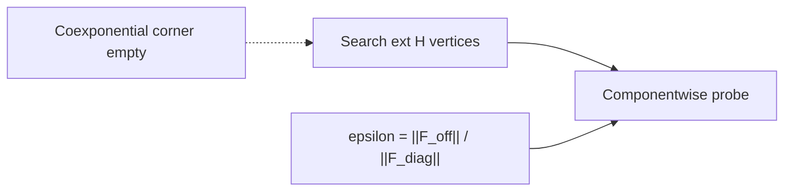

# Overview — Fisher-controlled extremal probes

Master map for the **categorical_polytope** toolkit: formal theorems, implemented algorithms, experiments, and how they connect to the categorical analogy (coproduct vs absent coexponential).

**Quick start**

```bash
cd ..   # package root (parent of this folder)
python experiments/run_all.py
python -m categorical_polytope
python -m unittest discover -s tests -v
```

See also: [`../docs/RUNBOOK.md`](../docs/RUNBOOK.md), [`../docs/FORMAL_THEOREMS.md`](../docs/FORMAL_THEOREMS.md), [`../docs/SHORT_NOTE.md`](../docs/SHORT_NOTE.md).

---

## Conceptual map

| Categorical | This toolkit |
|-------------|----------------|
| Coproduct \(A \sqcup B\) | Parameter blocks \(A, B\) on box \(H\) |
| Coexponential \(\dashv\) coproduct | **Absent in Set** → extremal selection + componentwise probe |
| Product \(\dashv\) exponential (CCC) | Corner \((\lambda_{\max}, \sigma_{\min}, B_{\max}, k_{\max})\) |
| Cross-naturality | Fisher off-diagonals \(F_{AB}\), leakage \(\varepsilon\) |



---

## Theorem 1 — Vertex localization

**Hypotheses.** \(H = \prod_i [a_i, b_i]\) compact box. \(C(\theta) = g(\theta_A) + h(\theta_B) + r(\theta)\) with \(g,h\) coordinatewise nondecreasing on their blocks and \(r\) axis-wise quasiconvex on \([a_i,b_i]\).

**Conclusion.** Every global maximizer \(\theta^\star \in H\) lies in \(\mathrm{ext}(H)\).

**Proof sketch.**

1. Weierstrass: continuous \(C\) on compact \(H\) \(\Rightarrow\) maximizer exists.
2. Fix coordinate \(i\). Slice \(\phi_i(t) = C(\ldots, t, \ldots)\) is monotone + quasiconvex on an interval \(\Rightarrow\) maximum at \(a_i\) or \(b_i\).
3. All coordinates at endpoints \(\Rightarrow\) \(\theta^\star\) is a box vertex.

**Implementation:** `hypersurface_box.py`, `vertex_probe.VertexProbeAlgorithm`, `conceptual_polytope.ConceptualPolytope`.

**Failure mode:** interaction `face_bowl` in `nonlinear_objective.py` can put the optimum in the interior of a face; then Theorem 1 hypotheses fail — use `grid_maximize()`.

---

## Theorem 2 — Separable near-optimality

**Hypotheses.** As Theorem 1. Block Fisher matrix

\[
F = \begin{pmatrix} F_{AA} & F_{AB} \\ F_{BA} & F_{BB} \end{pmatrix}, \quad
\varepsilon = \frac{\|F_{AB}\|_F}{\|F_{\mathrm{diag}}\|_F}.
\]

**Conclusion.** For joint maximizer \(\theta^\star\) and separable (block-coordinate) optimum \(\theta_{\mathrm{sep}}\):

\[
C(\theta^\star) - C(\theta_{\mathrm{sep}}) \le \Phi(\varepsilon), \quad
\Phi(\varepsilon) = \frac{1}{2}\frac{\varepsilon^2}{\lambda_{\min}}\|\theta^\star\|^2 \|F_{\mathrm{diag}}\|_F.
\]

**Threshold:** \(\varepsilon_0 = \lambda_{\min}/(L_g + L_h + \kappa_r)\). If \(\varepsilon \le \varepsilon_0\) and gap \(\le \Phi(\varepsilon)\), separable optimization is certified.

**Proof sketch.** Write \(F = F_{\mathrm{diag}} + E\), \(\|E\|_F \le \varepsilon \|F_{\mathrm{diag}}\|_F\). Quadratic perturbation + spectral bound on cross blocks; Lipschitz/curvature control remainders when \(\varepsilon < \varepsilon_0\).

**Implementation:** `fisher_factorization.py`, `formal_bounds.py`, `decomposition_stability.assess_decomposition`.

---

## Theorem 3 — Constructive probe

**Conclusion.** Probe \(p \in \mathrm{ext}(H_A) \times \mathrm{ext}(H_B)\) from marginal scores + top-\(k\) search satisfies \(C(p) \ge C(\theta_{\mathrm{sep}}) - \delta(\varepsilon)\) with \(\delta(\varepsilon) \le \Phi(\varepsilon)\).

**Algorithm (implemented in `fisher_pruned_search.py`):**

1. \(V_A = \mathrm{ext}(\mathrm{proj}_A H)\), \(V_B = \mathrm{ext}(\mathrm{proj}_B H)\).
2. Score marginals; take top-\(k\) candidates per block.
3. Evaluate feasible pairs \((v,w) \in T_A \times T_B\); nearest feasible vertex if needed.
4. Return best + certificate: \(\varepsilon\), \(\Phi(\varepsilon)\), strict pass/fail.

```python
from categorical_polytope import FisherPrunedVertexSearch, VertexProbeAlgorithm

pruned = FisherPrunedVertexSearch(fisher_epsilon=0.25, top_k=4).run()
full = VertexProbeAlgorithm(cross_info_bound=0.25).find_near_optimal_probe()
print(pruned.theta, pruned.certified, pruned.certify_reason)
```

---

## Module index (this package)

| Module | Role |
|--------|------|
| `set_category.py` | Coexponential obstruction in Set |
| `cartesian_closed.py` | Product–exponential (curry) |
| `hypersurface_box.py` | Box \(H\), \(C = g + h + r\) |
| `conceptual_polytope.py` | Diagram polytope scores |
| `adversarial_probe.py` | Cross-information + componentwise probe |
| `fisher_factorization.py` | Block Fisher, \(\Phi(\varepsilon)\) |
| `formal_bounds.py` | \(\varepsilon_0\), strict certification |
| `vertex_probe.py` | Constructive vertex search |
| `fisher_pruned_search.py` | Top-\(k\) Fisher-pruned search |
| `decomposition_stability.py` | Coproduct robustness sweep |
| `nonlinear_objective.py` | Non-quadratic \(C\), empirical Fisher |
| `extremal_substitute.py` | Operational substitute for coexponential |
| `neighboring_vertices.py` | Chu, continuation, coalgebra corners |
| `firsts.py` | Deliverables manifest |

---

## Design rules

| \(\varepsilon\) | Action |
|-----------------|--------|
| \(\le 0.10\) | Separable coproduct probe (certified) |
| \(0.10\)–\(0.25\) | Block coordinate ascent; verify gap \(\le \Phi\) |
| \(> 0.25\) | Joint solve or full \(\mathrm{ext}(H)\) search |

| Interaction (`nonlinear_objective`) | Vertex localization |
|-------------------------------------|---------------------|
| `bilinear`, `triple` | Yes on box |
| `face_bowl` | **No** — use grid reference |

---

## Experiments and figures

| Script | Output |
|--------|--------|
| `experiments/run_experiments.py` | `results.json` — Fisher coupling sweep |
| `experiments/nonlinear_experiments.py` | `nonlinear_results.json` — incl. `face_bowl` |
| `experiments/run_all.py` | Both + optional plots |
| `experiments/plot_results.py` | `figures/gap_vs_epsilon.png` |
| `experiments/plot_nonlinear.py` | `figures/nonlinear_face_bowl.png` |
| `notebooks/fisher_extremal_demo.ipynb` | Interactive demo |

**Strict certification** (both required): \(\varepsilon \le \varepsilon_0\) and \(\text{gap} \le \Phi(\varepsilon)\). See `results.json` field `certified_strict`.

---

## Non-quadratic extension

When \(C\) is not quadratic, estimate Fisher at the probe:

```python
from categorical_polytope import NonlinearStudy

r = NonlinearStudy().analyze(strength=1.5, interaction="face_bowl")
print(r.gap_vs_grid, r.localization_at_vertex)  # grid beats vertex when False
```

Empirical Fisher: `empirical_fisher_at()` (finite differences). Local \(\varepsilon\) and \(\Phi\) apply; global vertex localization may fail.

---

## Notebook alignment (stdlib package vs NumPy skeleton)

The runnable **package** uses stdlib only (`Theta`, `BoxBounds`, modules above). For a NumPy/Jupyter workflow, either:

- Import `categorical_polytope` in the notebook (recommended), or
- Use the skeleton below with the same block order: \(\theta = (\lambda, \sigma, b, k)\), blocks \(A=(\lambda,k)\), \(B=(b,\sigma)\) in assembly.

**Convention:** package `face_bowl` is **added** to \(C\) (interior of \((\lambda,\sigma)\) face wins); maximizing favors \(\lambda,\sigma \approx 0.5\) on that face. Any notebook using \(-\text{strength}\times\text{bowl}\) is the same geometry with signs flipped on the bowl term only.

```python
# Minimal notebook bridge — no NumPy required
import sys
from pathlib import Path
sys.path.insert(0, str(Path("..").resolve()))

from categorical_polytope import NonlinearStudy, VertexProbeAlgorithm

for strength in [0.5, 1.0, 2.0]:
    r = NonlinearStudy().analyze(strength=strength, interaction="face_bowl")
    print(strength, "gap_vs_grid", r.gap_vs_grid, "vertex_ok", r.localization_at_vertex)

probe = VertexProbeAlgorithm(cross_info_bound=0.25).find_near_optimal_probe()
print("CCC corner probe", probe.theta.as_corner_tuple(), probe.objective_value)
```

---

## Full proof expansions

For duplicated long-form proofs (Weierstrass slice, perturbation bound step C, Hoffman-type feasibility correction), see the git history of this file or expand from:

- Theorem 1: coordinate slice argument (Section above).
- Theorem 2: `docs/FORMAL_THEOREMS.md` + `formal_bounds.leakage_gap_bound`.
- Theorem 3: `fisher_pruned_search` + `adversarial_probe.build_componentwise_probe`.

---

## Discoveries (automated search)

```bash
python -m categorical_polytope discover
python experiments/run_discoveries.py
```

Outputs: `experiments/discoveries.json`, `docs/DISCOVERIES.md`, `docs/FORMAL_DISCOVERIES.md` — thresholds, failure modes, and **proof sketches** (Propositions A.1–G.1).

**Weekend research probes** (toposes, enriched Fisher, live learner ε): [`docs/RESEARCH_DIRECTIONS.md`](../docs/RESEARCH_DIRECTIONS.md), `python experiments/run_research_probes.py`.

## Publication checklist

- [x] `docs/EXPERIMENT_REPORT.md` — auto tables (`experiments/generate_report.py`)
- [x] `docs/PAPER_DRAFT.md` — extended draft with results
- [x] `docs/short_note.tex` + [`BUILD_PDF.md`](../docs/BUILD_PDF.md) — PDF path
- [x] Coexponential obstruction in experiment report
- [ ] GitHub remote + arXiv upload (fill `CITATION.cff` author/repo)

**Title (suggested):** *Extremal Selection as an Operational Substitute for Coexponentials: Fisher-Controlled Factorization*
