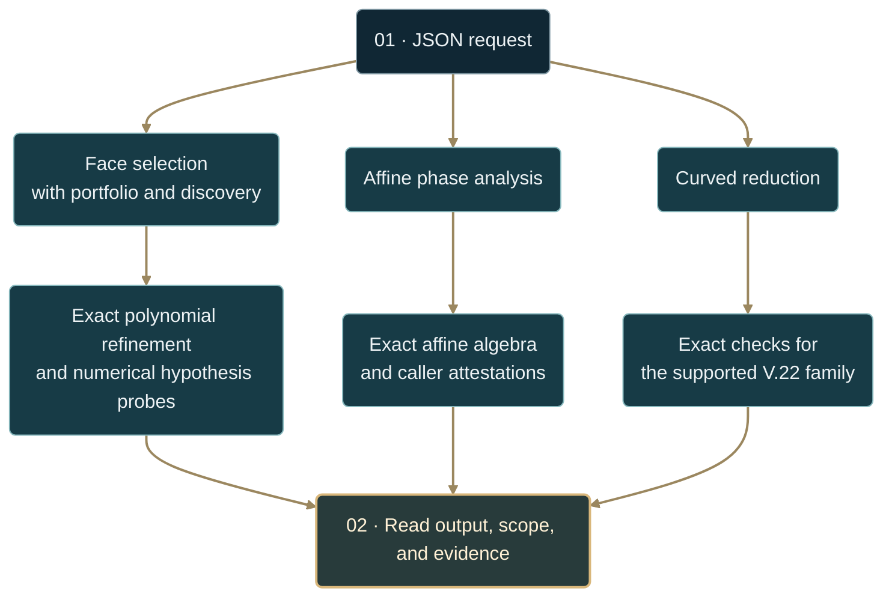

# Face-selection backend asset

**Current asset: `portable-principle.v8`** · face-selection schema:
`face-selection.backend.v1`

[**Version map →**](#portable-principle-version-map) · [Request contract](#request-contract) · [Status semantics](#face-selection-status-semantics) · [Reproduce the results](RUNBOOK.md) · [Shared architecture](../README.md#the-three-layer-selection-principle)

| 01 · Orthant | 02 · Polyhedron | 03 · Parameters | 04 · Execution |
| :--- | :--- | :--- | :--- |
| [Newton–tropical law](FORMAL_NEWTON_TROPICAL.md) | [Feasible-face selection](FORMAL_FACE_SELECTION.md) | [Qualified stratification](FORMAL_QUALIFIED_SELECTION_STRATIFICATION.md) | **This contract** |

The face-selection law is available as a stable backend capability, not only as
a mathematical helper. Its public boundary is
`categorical_polytope.adjudication.polyhedra.backend`.

The backend accepts a bounded polyhedral system, an unperturbed base objective,
and a perturbation. It executes the law through the exact ambient hierarchy
and presents it in three visible stages:

1. **Localization** - select a simple maximizing vertex and replace the global
   polyhedron by its tangent cone and active constraints.
2. **Selection** - restrict the perturbation to tangent-cone faces, classify
   each face, and select the smallest admissible weighted degree `q_star`.
3. **Scaling** - return $\gamma=1/(1-q_\ast)$ and the measured leading
   coefficient when it has stabilized.

Responses expose the evidence and scope used by each operation. The meaning
of `licensed` depends on that operation: exact algebra, numerical diagnostics,
and caller attestations must be read at their actual evidence level.



> [!IMPORTANT]
> `licensed` is an operation-specific scope decision. A general face-selection
> response still relies on numerical hypothesis probes; a phase response relies
> on supplied analytic attestations. Neither proves arbitrary analytic
> hypotheses from a JSON request. Curved reduction has its own exact supported
> contract, and finite-scale accuracy is a separate decision.

---

## Portable-principle version map

The version sections describe cumulative capability layers retained in the
current **v8** asset. Asset versions, JSON schema versions, and formal result
numbers identify different things: **V.20** is the transport theorem, not an
asset version. Its formal note names the current implementation, v8.

| Asset layer | Capability | Mathematical reference |
| :--- | :--- | :--- |
| [v2](#portable-principle-v2-extension) | Mechanism traces, term classification, universality classes, and portfolios | [Face-selection law](FORMAL_FACE_SELECTION.md) |
| [v3](#portable-principle-v3-exact-universality-phase-diagrams) | Exact affine degree walls and transition margins | [V.17 · phase fan](FORMAL_FACE_SELECTION_PHASE_FAN.md) |
| [v4](#portable-principle-v4-stratified-qualified-selection) | Coefficient cancellation and qualification strata | [V.18 · qualified selection](FORMAL_QUALIFIED_SELECTION_STRATIFICATION.md) |
| [v5](#portable-principle-v5-constructive-mixed-sign-positivity) | Constructive mixed-sign binomial witnesses | [V.19 · positivity](FORMAL_BINOMIAL_POSITIVITY_WITNESS.md) |
| [v6](#portable-principle-v6-exact-ambient-to-face-transport) | Exact feasible-chart pullbacks and term provenance | [V.20 · ambient transport](FORMAL_AMBIENT_FACE_TRANSPORT.md) |
| [v7](#portable-principle-v7-finite-family-exponent-discovery) | Finite perturbation screens and exponent-law candidates | [V.21 · discovery](FORMAL_EXPONENT_DISCOVERY_ENGINE.md) |
| [v8 · current](#portable-principle-v8-signed-layer-control-and-curved-channels) | Withhold licensing for uncontrolled higher layers; dispatch supported curved channels to a separate reduction contract | [Mathematical audit](MATHEMATICAL_AUDIT.md) · [V.22 · quadratic elimination](FORMAL_CURVED_REDUCTION.md) |

The face-selection, portfolio, phase, and discovery responses carry
`asset_version: "portable-principle.v8"` with the
`face-selection.backend.v1` schema. Curved reduction uses
`curved-reduction.backend.v1` and does **not** emit an `asset_version` field.
Its optional [finite-scale certificate](CURVED_FINITE_SCALE.md) is available
through the same backend entry point.

## Python integration

```python
from categorical_polytope import analyze_face_selection

response = analyze_face_selection({
    "request_id": "tilted-simplex",
    "system": "([[-1,0],[0,-1],[1,1]], [0,0,1])",
    "base": "-((x0+x1-1)**2 + x0**4)",
    "perturbation": "x0",
    "observed_exponent": 4 / 3,
})

assert response["status"] == "licensed"
assert response["selection"]["weighted_degree"] == 0.25
assert abs(response["scaling"]["response_exponent"] - 4 / 3) < 1e-9
assert response["active_constraints"]["released"] == [0]
assert response["active_constraints"]["binding"] == [2]
assert response["inverse"]["minimal_consistent_faces"] == [[0]]
```

For a long-running process, retain one backend instance so its domain object
can be reused:

```python
from categorical_polytope.adjudication.polyhedra.backend import FaceSelectionBackend

backend = FaceSelectionBackend()
first = backend.handle(first_payload)
batch = backend.handle_many([second_payload, third_payload])
```

`handle` is total at the request boundary. Malformed requests return an
`invalid_request` envelope; one malformed batch item never aborts its siblings.

## JSON process interface

One request or an array of requests can be sent over standard input:

```powershell
@'
{
  "request_id": "tilted-simplex",
  "system": "([[-1,0],[0,-1],[1,1]], [0,0,1])",
  "base": "-((x0+x1-1)**2 + x0**4)",
  "perturbation": "x0"
}
'@ | python -m categorical_polytope.adjudication.polyhedra.backend --pretty
```

The process exits with zero when every top-level response has status
`licensed`, `unlicensed`, or `complete`. The `complete` status marks a finished
portfolio or discovery operation; inspect its cases and scope evidence for
individual licensing decisions. Other statuses, including `refused`,
`outside_scope`, and boundary errors, return nonzero. Process success alone
does not certify a theorem or finite-scale accuracy.
After installing the package, the same interface is available as
`categorical-face-selection`.

## Request contract

The face-selection wire schema remains `face-selection.backend.v1`; the
current portable-law asset is `portable-principle.v8`. Existing consumers can
continue parsing the v1 envelope, but mathematical decisions can change:
v8 withholds licensing when higher-layer control is unresolved. Consumers must
respect the returned `status`, `licensed`, and `scope.blockers` rather than
assuming that an earlier licensed input remains licensed.

The following fields describe an individual face-selection request. Portfolio,
phase, discovery, and curved-reduction operations have the additional contracts
described below.

| Field | Required | Meaning |
| --- | --- | --- |
| `operation` | no | Defaults to `polyhedral_face_selection`; other operations are described in their sections |
| `system` | yes | Literal `([[...]], [...])` representation of $Ax\le b$ |
| `base` | yes | Safely parsed arithmetic expression in `x0`, `x1`, ... |
| `perturbation` | yes | Safely parsed perturbation expression; `pert` is accepted as an alias |
| `request_id` | no | Caller correlation identifier, at most 128 characters |
| `observed_exponent` | no | Activates the inverse law $q_{\mathrm{obs}}=1-1/\gamma_{\mathrm{obs}}$ |
| `observation_tolerance` | no | Face-matching tolerance; defaults to `0.05` |

Expressions are capped at 20,000 characters and pass through the existing
whitelisted arithmetic parser. Python calls, imports, attribute access, and
other executable syntax are not evaluated.

## Response contract

A face-selection analysis returns the following fields; individual values may
be unavailable when localization or selection is refused. Other operations
have their own response layouts.

| Field | Backend use |
| --- | --- |
| `schema_version` | JSON contract identifier: `face-selection.backend.v1` |
| `asset_version` | Current capability and licensing revision: `portable-principle.v8` |
| `status` | `licensed`, `unlicensed`, or `refused` |
| `answered` | Whether a response exponent was produced |
| `licensed` | Whether the operation's admission checks pass; read the evidence and limitations in `scope` |
| `capabilities` | Stable names for the asset's supported reasoning functions |
| `principles` | Machine-readable localization, selection, and scaling definitions |
| `localization` | Vertex, tangent-cone face count, binding and released constraints |
| `selection` | `q_star`, winning faces, every examined face and relevance classes |
| `scaling` | Response exponent, power-law form, coefficient and convergence status |
| `active_constraints` | Geometric interpretation of the selected asymptotic channel |
| `mechanism` | Complete ambient-to-face-to-weight-to-exponent causal trace |
| `ambient_hierarchy` | Exact base and perturbation pullbacks, term lineage, face suppressions, weights, selection and exponent consequence |
| `perturbation_analysis` | Per-term relevance, dominance, cancellation and supporting faces |
| `universality_class` | Stable class identifier derived from `q_star` and `gamma` |
| `exact_refinement` | Polynomial edge-transport correction with measured values retained for audit |
| `scope` | Hypothesis measurements, blockers, and refusal reason |
| `inverse` | Optional observed-exponent calibration and consistent faces |
| `audit` | Rule identifier, engine and backend contract version |

The four relevance classes are `relevant`, `critical`, `subleading`, and
`inactive`. Every filtered face includes its reason. This is how the backend
filters irrelevant directions without erasing the evidence that they were
considered.

For supported polynomial inputs, transport uses exact rational arithmetic
relative to the localized chart. Inspect `ambient_hierarchy.chart_source`
to distinguish exact active-constraint reconstruction from a chart derived
from the numerical probe. Every
top-level perturbation term retains its lineage; cancellations and per-face
geometric suppressions are reported separately. Non-polynomial inputs use the
safe numerical fallback. See [V.20](FORMAL_AMBIENT_FACE_TRANSPORT.md).

## Discovery operation

`operation = "discover"` promotes the compiler into a finite-family discovery
engine. Supply the common `system` and `base`, then either an explicit
`candidates` array or a generated `family` such as:

```json
{
  "operation": "discover",
  "system": "([[-1,0],[0,-1],[1,0],[0,1]], [0,0,1,1])",
  "base": "-(x0**2 + x1**4)",
  "family": {
    "kind": "ambient_monomials",
    "max_total_degree": 2
  }
}
```

The response contains screening counts, exact mechanism fingerprints,
universality classes, the discrete exponent-law spectrum, registry-relative
law candidates, and diagnostic candidates. `include_cases = true` attaches
every full backend response; it defaults to false so large screens stay
compact. See [V.21](FORMAL_EXPONENT_DISCOVERY_ENGINE.md).

## Curved channels by exact quadratic elimination

Set `operation` to `curved_reduction` (alias `polyhedral_curved_reduction`)
to use the [quadratic-elimination theorem](FORMAL_CURVED_REDUCTION.md).
This operation accepts the same `system`, `base`, `perturbation`, and optional
`request_id` fields. It has its own `curved-reduction.backend.v1` response
contract: `localization`, `reduction`, `scaling`, and `scope`.

In exact two-dimensional inward coordinates, the full loss and centered
perturbation must have the forms

$$
D=Ax^p+By^q,\qquad R=-ax^2+xH(y)+K(y),
$$

with $A,B,a\gt0$, integer $p,q\gt1$, and $H(0)=K(0)=0$. The operation combines

$$
S(y)=\frac{H(y)^2}{4a}+K(y)
=Cy^\alpha+\text{higher powers}
$$

exactly. It requires $C\gt0$, $0\lt\alpha\lt q$, a positive leading
coefficient of $H$ at order $r$, and $pr\gt q$. These checks license

$$
\gamma=\frac{q}{q-\alpha}
$$

and the [sharp coefficient](FORMAL_CURVED_REDUCTION.md). The full base,
simple vertex, feasibility, and boundedness are checked exactly within this
supported family.

Supported cases return `status="licensed"`; unproved cases return
`status="outside_scope"` with blockers and vertex attempts. A refused
reduction does not assert that the true response vanishes. The original
face-selection operation retains its separate scope and audit.

Example: [`curved_reduction_request.json`](../experiments/curved_reduction_request.json).

Add `"finite_scale": {"s": "1e-12", "relative_tolerance": "1/10"}` to request
a rigorous interval for the actual response and an accuracy decision at that
scale. The additive `finite_scale` response reports `within_tolerance`,
`outside_tolerance`, or `not_resolved` separately from the asymptotic license.
Without this option it reports `not_requested`; a reduction outside V.22's
scope reports `not_available` when the option was supplied. The scaling block
explicitly states that polynomial coefficients are fixed in its limiting law.
See the [finite-scale contract and proof](CURVED_FINITE_SCALE.md) for exact
arithmetic, feasibility evidence, resource limits, and a cancellation example.

## Face-selection status semantics

### `licensed`

The exponent was produced and all measured hypotheses hold: the selected
vertex is simple, every edge order exceeds one, the base has the required
weighted homogeneity, and the maximizer is isolated to the resolution of the
probe. The winning face degree and all potentially competing face degrees must
also have settled numerically. For exactly transported polynomials, unresolved
positivity or higher positive layers block licensing even if the numerical
face probes appear settled. See the corrected upper-bound hypothesis and
exact counterexample in [the mathematical audit](MATHEMATICAL_AUDIT.md).

The isolation probe establishes that no rival was found at its resolution;
it does not prove a unique global maximizer. Likewise, a measured homogeneity
near one does not prove the complete diagonal principal-part identity or its
uniform remainder. This status reports the backend's admission criteria,
with exact polynomial safeguards where available.

### `unlicensed`

The algebraic exponent was produced but at least one analytic hypothesis is
unmet, a potentially competing face degree remains numerically unsettled,
or exact transport finds an uncontrolled higher positive layer near zeros of
a non-positive initial form (`higher_order_unresolved`).
The number is returned because it is diagnostically valuable; the
`scope.blockers` list prevents a caller from mistaking it for a warranted
conclusion.

### `refused`

The setting lies outside this law: examples include an unbounded system, no
simple maximizing vertex, no positively active face, or a winning degree
outside `(0,1)`. Localization evidence reached before the refusal remains in
the response. A refusal for lack of a qualified face does not prove zero
response: curved approaches can produce gains beyond the current selector.
`exact_refinement.selection_complete`, `unresolved_faces`, and the scope
blockers distinguish unresolved cases.

The `active_constraints` field describes candidate leading channels. Exact
optimizer support can include additional coordinates at subleading scales;
face-degree selection alone does not certify that the reported binding
constraints remain equalities at every small positive perturbation.

### `invalid_request` and `analysis_error`

These are boundary errors rather than mathematical outcomes. They are returned
as JSON envelopes and never interrupt a batch.

## Forward and inverse power

The forward path computes

$$
\text{feasible face data}\longmapsto q_\ast
\longmapsto\gamma=\frac1{1-q_\ast},
$$

together with candidate leading channels and a measured amplitude.

Given an observed exponent $\gamma_{\mathrm{obs}}\gt1$, the inverse path uses

$$
q_{\mathrm{obs}}=1-\frac1{\gamma_{\mathrm{obs}}},
$$

then compares that weight with the numerical predictor's admitted face
degrees within the supplied absolute weight tolerance. The inverse block
uses those measured face degrees, even when exact refinement corrects the
forward invariants. The result may be unique, ambiguous, or unmatched.

This diagnoses compatibility with candidate leading mechanisms. It does not
uniquely reconstruct an arbitrary objective or determine the optimizer's
complete support.

## Relationship to the exact core

`categorical_polytope.face_selection` represents supplied edge charts,
polynomial monomials, rational weights, and explicit hypothesis evidence. The backend
uses `adjudication.polyhedra.predict`, which derives and measures the same law
from a general inequality system and safe expressions. The two layers serve
different roles:

- core: theorem objects, rational weights and exponents, combined monomials,
  and explicit positivity witnesses; chart coordinates and witness evaluations
  may use floating-point values;
- backend predictor: automatic localization, numerical hypothesis probes,
  and exact polynomial transport/refinement when supported.

The core distinguishes `VERIFIED` from `ASSUMED` analytic hypotheses and
permits conditional use under either. The label is retained; the module does
not turn an assumption into independent proof.

Both preserve the same invariant: the Newton minimum is taken only after
restriction to feasible tangent-cone faces.

## Portable-principle v2 extension

### Mechanism explanation

`mechanism` makes the theory's internal hierarchy queryable:

$$
\text{transported perturbation}
\longmapsto\text{qualified face weights}
\longmapsto(q_\ast,\gamma).
$$

It also returns every relevant degree, the next competing degree, the
selection margin, tied minimal channels, filtered-face reasons, active
constraints, and the separation between universal exponent information and
the model-specific leading coefficient.

### Term-level perturbation classification

Top-level additive terms are classified independently as:

- `relevant` - positive on an admissible face with $0\lt q\lt1$;
- `critical` - $q=1$, requiring a different balance;
- `subleading` - $q\gt1$;
- `inactive` - eliminated by sign, cancellation, constancy, or geometry;
- `unresolved` - a mixed-sign initial form needs additional positivity evidence.

Relevant terms receive a role:

- `dominant` - attains the full perturbation's `q_star`;
- `higher_order` - relevant but asymptotically weaker;
- `cancelled_or_suppressed_in_sum` - would have a lower individual weight, but
  does not control the complete perturbation.

Polynomial terms are transported symbolically from ambient coordinates into
the localized edge chart and classified through the exact face-selection core.
Non-polynomial terms fall back to the measured face-restriction predictor. The
full-sum prediction always remains authoritative because independently
classified terms can cancel.

The same transport is run on the complete perturbation. When every relevant
symbolic face is resolved, its exact `q_star` and `gamma` become the public
universality invariants. The numerical predictor's original values remain in
`selection.measured_weighted_degree` and
`scaling.measured_response_exponent`, while `exact_refinement` records the
correction and its supporting faces. This prevents finite-scale drift from
turning `1/4` into a spurious nearby universality class. If symbolic positivity
is unresolved, no refinement is applied.

### Universality classes

An answered case receives an identifier such as:

```text
face-weight:1/4|response:4/3
```

The identifier captures the universal leading exponent while leaving the
coefficient outside the class. Rescaling a perturbation coefficient therefore
does not change the class; changing the winning admissible weight does.

### Portfolio comparison

Related geometries, constraints, bases, or perturbations can be submitted as a
portfolio:

```python
from categorical_polytope.adjudication.polyhedra.backend import FaceSelectionBackend

comparison = FaceSelectionBackend().handle({
    "operation": "portfolio",
    "request_id": "constraint-study",
    "cases": [baseline_case, rescaled_case, constrained_case],
})
```

The response groups cases into universality classes and compares consecutive
cases. Each transition is one of:

- `same_universality_class`;
- `universality_class_transition`;
- `unresolved_transition`.

Transitions report shifts in `q_star` and `gamma`, along with constraints that
became binding, ceased binding, became released, or ceased being released.
This directly operationalizes the implication that adding or changing
constraints can change the asymptotic universality class.

## Portable-principle v3: exact universality phase diagrams

The portfolio operation compares finitely supplied cases. The v3
`phase_diagram` operation instead resolves an entire continuous
one-parameter family from exact affine weighted-degree laws.

```python
phase = FaceSelectionBackend().handle({
    "operation": "phase_diagram",
    "parameter": "theta",
    "domain": ["0", "3/4"],
    "mechanisms": [
        {
            "id": "face-a",
            "face": ["x"],
            "degree": {"intercept": "1/4", "slope": "1/2"},
        },
        {
            "id": "face-b",
            "face": ["y"],
            "degree": {"intercept": "1/2", "slope": "-1/2"},
        },
    ],
    "assumptions": {
        "fixed_admissibility": True,
        "affine_degrees_verified": True,
        "uniform_local_base_maximality": True,
        "uniform_principal_remainder": True,
        "uniform_global_isolation": True,
    },
})
```

The backend computes every pairwise degree crossing and every relevance wall
$q=0$ or $q=1$ in exact rational arithmetic. It returns:

- all exact breakpoints;
- the winning face mechanisms in each open chamber;
- tied winners at transition walls;
- activation, deactivation, and universality-class transitions; and
- the exact chamber law $\gamma(\theta)=1/(1-q_\ast(\theta))$.

### Automatic Newton-weight compilation

Mechanisms do not need to arrive with a precomputed degree. Given fixed base
orders `beta_i` and affine monomial exponent laws `alpha_i(theta)`, the backend
derives

$$
q(\theta)=\sum_i\frac{\alpha_i(\theta)}{\beta_i}
$$

exactly:

```json
{
  "operation": "phase_diagram",
  "parameter": "theta",
  "domain": ["0", "3/4"],
  "base_orders": {"x": 4, "y": 2},
  "mechanisms": [
    {
      "id": "face-a",
      "exponents": {"x": {"intercept": 1, "slope": 2}}
    },
    {
      "id": "face-b",
      "exponents": {"y": {"intercept": 1, "slope": -1}}
    }
  ],
  "evaluate_at": ["0", "1/8", "1/4", "1/2"],
  "assumptions": {
    "fixed_admissibility": true,
    "affine_degrees_verified": true,
    "uniform_local_base_maximality": true,
    "uniform_principal_remainder": true,
    "uniform_global_isolation": true
  }
}
```

Each mechanism must supply either `degree` or `exponents`, never both. Base
orders must exceed one; exponent axes must occur in `base_orders`; and exponent
laws must remain nonnegative on the requested closed domain.

### Exact queries and robustness margins

`evaluate_at` requests selection at up to 256 parameter values. Every result
includes:

- the exact selected degree and response exponent;
- whether the point is in an open chamber, on a candidate wall, or on an
  actual universality transition;
- the winning mechanisms, including ties at a wall;
- the nearest actual transition; and
- the exact parameter distance to a change in universality mechanism.

This distance measures stability of the **winning mechanism identities**
under parameter changes that stay inside the domain. The exponent can still
vary with the parameter inside a chamber. It is not a bound on exponent
error or finite-scale approximation error. Zero marks an interior transition;
`null` means no interior transition exists. Endpoint qualification is evaluated
separately.

This is not a grid search: between consecutive returned walls, no unreported
degree-order transition can occur under the declared assumptions. The
multi-parameter generalization replaces the wall points by affine hyperplanes,
forming the universality phase fan of Theorem V.17. See
[`FORMAL_FACE_SELECTION_PHASE_FAN.md`](FORMAL_FACE_SELECTION_PHASE_FAN.md).

The operation remains scope-aware. Without explicit verification of fixed
admissibility and affine degree laws, the exact algebraic diagram is returned
as `unlicensed` with blockers. Parameter-dependent geometry, positivity, and
cancellation must be introduced as additional stratum walls.

## Portable-principle v4: stratified qualified selection

v4 makes parameter-dependent qualification executable. A mechanism may carry
an affine `coefficient` law in addition to its degree or exponent law. The
backend adds every exact coefficient-zero root to the phase
stratification and qualifies the mechanism only where that coefficient is
positive.

```json
{
  "operation": "phase_diagram",
  "parameter": "theta",
  "domain": [0, 1],
  "mechanisms": [
    {
      "id": "emerging-low-face",
      "degree": {"intercept": "1/4"},
      "coefficient": {"intercept": "-1/3", "slope": 1}
    },
    {
      "id": "positive-fallback",
      "degree": {"intercept": "1/2"}
    }
  ],
  "evaluate_at": ["1/4", "1/3", "1/2"],
  "assumptions": {
    "fixed_admissibility": true,
    "coefficient_qualification_verified": true,
    "affine_degrees_verified": true,
    "uniform_local_base_maximality": true,
    "uniform_principal_remainder": true,
    "uniform_global_isolation": true
  }
}
```

Every evaluation now contains a `qualified_selection` certificate. Each
mechanism is classified as `qualified`, `cancelled`, `non_positive`,
`zero_weight`, `critical`, `subleading`, or `geometry_filtered`. The minimum is
taken only after this classification.

The three uniform analytic flags are required before the backend reports

$$
q_\ast(\theta)\longmapsto\gamma(\theta)
\longmapsto\Delta(s;\theta)=\Theta(s^{\gamma(\theta)})
$$

as a licensed conditional consequence. These flags are **caller attestations**,
not independently verified properties of an objective. The phase operation
does not reconstruct the full perturbation or run the default polynomial
selector's signed-layer checks. It has no separate flag or automatic test for
the corrected positive-gain upper envelope, which remains an external
mathematical obligation. Any layer exposed by cancellation must be included
in the supplied mechanisms or handled on another stratum. See
[`FORMAL_QUALIFIED_SELECTION_STRATIFICATION.md`](FORMAL_QUALIFIED_SELECTION_STRATIFICATION.md).

## Portable-principle v5: constructive mixed-sign positivity

The exact polynomial bridge now resolves a mixed-sign weighted-homogeneous
binomial whenever its two combined monomial signatures are distinct. It varies
one relative-interior face coordinate until the positive-to-negative monomial
ratio exceeds the coefficient ratio, then validates the resulting witness
against both the principal part and initial form.

The response retains this proof object in `exact_refinement`:

```json
{
  "positivity_certificates": [
    {
      "face": [0, 1],
      "provenance": "mixed-sign binomial ratio certificate",
      "coordinates": {"c0": 0.125, "c1": 1.0},
      "initial_form_value": 0.75
    }
  ]
}
```

The precise coordinates depend on coefficient ratios and which differing
exponent coordinate is selected. The contractual facts are that all face
coordinates are positive and `initial_form_value > 0`.

General mixed-sign initial forms with three or more distinct signatures remain
`positivity_unresolved` unless another exact certificate or caller witness is
available. See
[`FORMAL_BINOMIAL_POSITIVITY_WITNESS.md`](FORMAL_BINOMIAL_POSITIVITY_WITNESS.md).

## Portable-principle v6: exact ambient-to-face transport

The [V.20 compiler](FORMAL_AMBIENT_FACE_TRANSPORT.md) reconstructs the inward
edge chart from the active constraints and transports both the base and the
perturbation into that chart. With active set $S$,

$$
A_Sv=b_S,\qquad A_Su_i=-e_i,\qquad
\Phi(c)=v+\sum_i c_i u_i.
$$

The polynomial used for feasible-face selection is

$$
\widehat R(c)=R(\Phi(c))-R(v).
$$

Like monomials are combined before selection. Ambient coordinate-axis orders
cannot replace the orders in the feasible chart. Exact transport also keeps
algebraic cancellation distinct from terms suppressed by a face restriction.

| Response evidence | What to inspect |
| :--- | :--- |
| `ambient_hierarchy.chart_source` | How the feasible chart was reconstructed |
| `ambient_hierarchy.base_pullback` | Transported base polynomial |
| `ambient_hierarchy.perturbation_pullback` | Combined polynomial, term lineage, cancellations, and face restrictions |
| `ambient_hierarchy.weight_layer` | Exact pullback axial orders, weights, and comparison with measured orders |
| `ambient_hierarchy.selection_layer` | Selected degree and supporting faces |
| `transitions[].ambient_transport_change` | Chart and pullback changes in a portfolio |

Run the saved two-geometry portfolio from the repository root:

```bash
python -m categorical_polytope.adjudication.polyhedra.backend --input experiments/face_selection_ambient_v20_request.json --pretty
```

Both cases return `face-weight:1/4|response:4/3` with pullback axial orders
`{"c0": 4, "c1": 2}`. The portfolio records `same_universality_class` while
`ambient_transport_change.changed` is `true`: the charts differ, and the
selected exponent agrees. Exact transport supplies algebraic evidence;
the [v8 scope checks](#portable-principle-v8-signed-layer-control-and-curved-channels)
still govern licensing.

[Saved request →](../experiments/face_selection_ambient_v20_request.json) · [Compiler tests →](../tests/test_ambient_face_compiler.py)

## Portable-principle v7: finite-family exponent discovery

The [discovery operation](#discovery-operation) applies the compiler to every
member of a supplied finite perturbation family. It groups the resulting
weights and exponents into universality classes while retaining distinct
mechanism fingerprints and diagnostics.

```bash
python -m categorical_polytope.adjudication.polyhedra.backend --input experiments/face_selection_discovery_v21_request.json --pretty
```

The saved request screens six candidates against the base loss
$x_0^2+x_1^4$. It returns five relevant candidates, one critical candidate,
and three classes:

| Selected weight $q_\ast$ | Response exponent $\gamma$ | Members |
| :--- | :--- | :--- |
| $1/4$ | $4/3$ | $x_1$ |
| $1/2$ | $2$ | $x_0$, $x_1^2$, $x_1-x_1+x_0$ |
| $3/4$ | $4$ | $x_0x_1$ |

Inspect `screening.counts`, `universality_classes`, `exponent_law_spectrum`,
`law_candidates`, and `diagnostic_candidates`. The $x_0^2$ candidate reaches
the critical $q=1$ boundary; the cancelled-linear candidate retains its
cancellation diagnostic after joining the $q_\ast=1/2$ class.

The supplied registry already contains the $4/3$ class, so the other two
classes are unregistered law candidates. Registry absence is not a claim of
literature novelty. Likewise, a completed finite screen does not exhaust all
perturbations or prove its members' analytic hypotheses. Set
`include_cases: true` to inspect each full response and its licensing evidence.

[V.21 statement →](FORMAL_EXPONENT_DISCOVERY_ENGINE.md) · [Saved request →](../experiments/face_selection_discovery_v21_request.json) · [Discovery tests →](../tests/test_face_selection_discovery.py)

## Portable-principle v8: signed-layer control and curved channels

v8 corrects a scope error: a non-positive first weighted layer can leave a
higher positive layer uncontrolled near its zeros. The exact face selector
must establish the required upper control before discarding that face. When
it cannot, it records `higher_order_unresolved` and blocks theorem licensing.

Inspect `exact_refinement.selection_complete`,
`exact_refinement.unresolved_faces`, `exact_refinement.selection_blockers`,
and `scope.blockers`. An incomplete selection yields `unlicensed` when the
numerical predictor produced an exponent and `refused` otherwise. This is a
mathematical correction despite the unchanged face-selection wire schema.

For the canonical loss $x^6+y^6$ and perturbation $-x^2+xy^2$,

$$
-x^2+xy^2=\frac{y^4}{4}-\left(x-\frac{y^2}{2}\right)^2.
$$

The original selector leaves the full face unresolved. The separately scoped
[curved-reduction operation](#curved-channels-by-exact-quadratic-elimination)
resolves this example by V.22 and returns an exact exponent and coefficient.
It must be requested explicitly; the original selector does not automatically
switch operations.

| Request | Expected result |
| :--- | :--- |
| Original selector, with `operation` omitted | `refused`, `licensed: false`, unresolved face `[[0,1]]` |
| `operation: "curved_reduction"` | `licensed`, $\gamma=3$, leading coefficient $1/432$ |
| Curved reduction after adding $-y^4/4+y^5$ | `licensed`, $\gamma=6$, leading coefficient $3125/46656$ |

Reproduce the three cases and the separate finite-scale accuracy check:

```bash
python experiments/reproduce_principle.py --only selector-limit curved curved-cancellation finite-scale
```

The runner treats the original selector's nonzero exit as an expected refusal.
In the finite-scale pair, both requests retain the exponent-3 asymptotic
license, while the accuracy decisions differ. The scale, tolerance, exact
intervals, and feasibility evidence are documented in the
[runbook](RUNBOOK.md#finite-scale-accuracy-is-a-separate-question).

[Corrected hypothesis and counterexample →](MATHEMATICAL_AUDIT.md) · [V.22 theorem →](FORMAL_CURVED_REDUCTION.md) · [Finite-scale contract →](CURVED_FINITE_SCALE.md)

---

## Reproduce and inspect

```bash
python experiments/reproduce_principle.py
```

The [runbook](RUNBOOK.md) maps each request to expected results, scope
decisions, and evidence fields. The runner preserves requests, full outputs,
explicit checks, and source hashes in a fresh directory.

[Return to the theorem →](FORMAL_FACE_SELECTION.md) · [Documentation revision record](PRINCIPLE_DOCUMENTATION_REVIEW.md)
