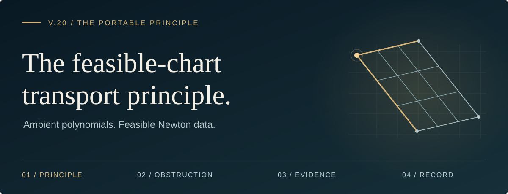
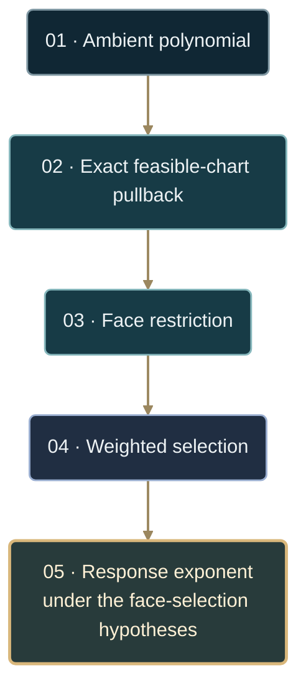

# The feasible-chart transport principle

Formal result **V.20** · backend asset `portable-principle.v8` · exact compiler:
`categorical_polytope/ambient_face_compiler.py`.

[**Read the statement →**](#statement) · [Mathematical audit](MATHEMATICAL_AUDIT.md) · [Exact compiler](../categorical_polytope/ambient_face_compiler.py) · [Regression suite](../tests/test_ambient_face_compiler.py)

| 01 · The principle | 02 · The obstruction | 03 · The evidence | 04 · The record |
| :--- | :--- | :--- | :--- |
| [Feasible-chart transport](#statement) | [Why ambient axes fail](#why-ambient-axes-fail) | [Canonical counterexamples](#the-two-canonical-counterexamples) | [Provenance and warrant](#provenance-cancellation-and-suppression) |

---

<sub>01 / THE PRINCIPLE</sub>

## Statement

Let $v$ be a simple vertex of $P=\lbrace x:Ax\le b\rbrace$, let $S$ be its active
constraint set, and define the inward edge chart

$$
\Phi(c)=v+\sum_{i=1}^n c_i u_i,
\qquad c_i\ge0,
$$

by the exact systems

$$
A_Sv=b_S,
\qquad A_Su_i=-e_i.
$$

For an ambient polynomial perturbation $R(x)$, the Newton data governing
face selection is the exact pullback

$$
\widehat R(c)=R(\Phi(c))-R(v),
$$

after like monomials have been combined. It is not, in general, the data
obtained by probing ambient coordinate axes. For each nonempty orthant face
$F$, restrict $\widehat R$ to $F$ and take its first nonzero weighted layer,
of degree $q_F$. Qualify that layer only if $0\lt q_F\lt 1$ and it is positive
somewhere in the relative interior of $F$; do not skip an earlier negative
layer in search of a positive one. When qualified faces exist, select

$$
q_\ast=\min_{F\text{ qualified}}q_F,
\qquad
\gamma=\frac1{1-q_\ast}.
$$

> [!IMPORTANT]
> The exponent is a theorem consequence only under the corrected
> face-selection hypotheses, including the uniform positive-gain upper
> envelope. Exact transport alone does not control higher layers near zeros
> of a non-positive initial form; see [the mathematical audit](MATHEMATICAL_AUDIT.md).

Thus the authoritative hierarchy is



<details>
<summary><strong>Read the symbolic hierarchy</strong> · the same five stages</summary>

$$
\boxed{
\text{ambient polynomial}
\longrightarrow
\text{exact feasible-chart pullback}
\longrightarrow
\text{face restriction}
\longrightarrow
\text{weighted selection}
\longrightarrow
\text{response exponent}.}
$$

</details>

Positive rescaling of an edge generator changes pullback coefficients but not
monomial supports, axial orders, weighted degrees, winning faces, or the
response exponent. When the base pullback has a nonzero pure axial term on
every edge, the compiler derives $\beta_i$ from its first axial order and uses
the exact Newton weight $w_i=1/\beta_i$. Numerical directional-order detection
is retained only as a labeled fallback.

---

<sub>02 / THE OBSTRUCTION</sub>

## Why ambient axes fail

An ambient coordinate axis need not lie in the tangent cone. Restricting the
base or perturbation along such a direction can therefore introduce an order
that no feasible displacement realizes. Selection based on that order is not
coordinate invariant and can predict the wrong exponent.

The compiler consequently reconstructs the chart from the active constraints
using rational arithmetic. Rounded display vectors are never treated as exact:
doing so can break an identity such as $x_0+2x_1-2=0$ along an edge and
manufacture a false quadratic term.

---

<sub>03 / THE EVIDENCE</sub>

## The two canonical counterexamples

The v10 corpus contained five counterexamples among 349 records. After the
edge-rule repairs, the active 432-record corpus contains exactly two:
`simplex_quartic_ambient` and `sheared_quartic_ambient`. Both belong to the
ambient-axis control. This survival pattern isolates the coordinate-transport
obstruction from the three repaired edge-rule failures.

### Simplex · the feasible quartic direction

At the simplex vertex $(0,1)$, use generators
$u_0=(1,-1)$, $u_1=(0,-1)$. Then

$$
-((x_0+x_1-1)^2+x_0^4)\circ\Phi
=-(c_1^2+c_0^4),
\qquad x_0\circ\Phi=c_0.
$$

### Sheared simplex · the same transported orders

At the sheared vertex $(0,1)$, the active-constraint solve may use
$u_0=(1,-1/2)$, $u_1=(0,-1/2)$. Then

$$
-((x_0+2x_1-2)^2+x_0^4)\circ\Phi
=-(c_1^2+c_0^4),
\qquad x_0\circ\Phi=c_0.
$$

### One structural counterexample family

In both cases the feasible base orders are $(4,2)$, so the perturbation has
$q_\ast=1/4$ and

$$
\gamma=\frac1{1-1/4}=\frac43.
$$

The ambient-axis control predicts $2$; the measured exponent is $4/3$.
These are therefore not two unrelated anomalies. They are one structural
counterexample family proving that ambient axes must be compiled through the
feasible chart before Newton classification.

---

<sub>04 / THE RECORD</sub>

## Provenance, cancellation, and suppression

The exact compiler retains every top-level additive ambient term. For each
edge monomial it records all contributing ambient-term indices before summing
their rational coefficients. This yields two distinct, auditable outcomes:

- **cancellation:** contributions reach the same edge signature and sum to
  zero;
- **geometric suppression:** a term becomes constant under localization or
  restricts to zero on a particular feasible face.

Top-level terms are classified independently, but the combined pullback is
authoritative. This prevents a pair such as $x_0-x_0$ from being reported as
the dominant mechanism and prevents high-order polynomial terms from
disappearing because a numerical probe underflows. Non-polynomial expressions
retain the safe numerical fallback and are labeled as such.

## Executable warrant

The public backend exposes the complete object in `ambient_hierarchy`, with
`base_pullback`, `perturbation_pullback`, `weight_layer`, `selection_layer`, and
`exponent_layer`. Portfolio transitions compare exact chart generators,
transport signatures, cancellation counts, and geometrically suppressed term
indices. The canonical regression suite is
`tests/test_ambient_face_compiler.py`.

<details>
<summary><strong>Run the canonical regression suite</strong> · from the repository root</summary>

```bash
python -m pytest tests/test_ambient_face_compiler.py -q
```

[Open the regression tests →](../tests/test_ambient_face_compiler.py)

</details>

<details>
<summary><strong>Follow the implementation and hypotheses</strong> · source index</summary>

| Source | Read |
| :--- | :--- |
| Exact compiler | [ambient_face_compiler.py](../categorical_polytope/ambient_face_compiler.py) |
| Public backend contract | [FACE_SELECTION_BACKEND.md](FACE_SELECTION_BACKEND.md) |
| Corrected hypotheses and limitations | [MATHEMATICAL_AUDIT.md](MATHEMATICAL_AUDIT.md) |
| Newton–tropical theorem | [FORMAL_NEWTON_TROPICAL.md](FORMAL_NEWTON_TROPICAL.md) |

</details>

---

[**Return to the principle ↑**](#the-feasible-chart-transport-principle) · [Explore the project →](../README.md)
