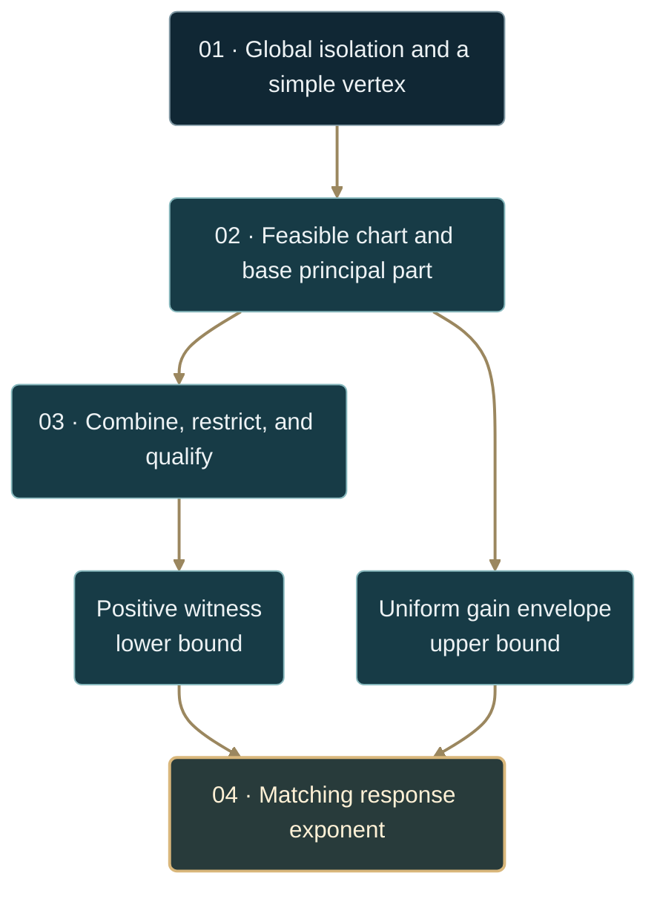

# Face-selection law at a simple polyhedral vertex

**The polyhedral theorem** · exact face algebra with explicit analytic hypotheses

[**Read the conclusion →**](#8-selection-qualified) · [Hypotheses](#4-hypotheses-with-uniform-remainders) · [Signed obstruction](#6-upper-control-on-unqualified-faces) · [Worked geometry](#9-worked-case-the-tilted-simplex)

| 01 · Orthant | 02 · Polyhedron | 03 · Parameters | 04 · Execution |
| :--- | :--- | :--- | :--- |
| [Newton–tropical law](FORMAL_NEWTON_TROPICAL.md) | **This theorem** | [Qualified stratification](FORMAL_QUALIFIED_SELECTION_STRATIFICATION.md) | [Backend contract](FACE_SELECTION_BACKEND.md) |

At a simple vertex, inward edge coordinates turn the tangent cone into an
orthant. The selection rule then restricts the **combined perturbation** to
each feasible face, qualifies its first nonzero weighted layer, and takes the
least qualified degree. A separate upper bound controls signed channels that
qualification alone can miss.



> [!IMPORTANT]
> A qualified minimum supplies a candidate exponent and a lower bound.
> The theorem also needs **Hypothesis 5**, the uniform positive-gain envelope.
> An unresolved signed face is not evidence that its contribution vanishes.
> [The mathematical audit](MATHEMATICAL_AUDIT.md) records the counterexample.

---

## 0. Standing assumptions

Let $P\subset\mathbb R^n$ be a bounded full-dimensional polyhedron. Let $F,G$
be continuous on $P$ and real analytic near the vertex under study. The
centered perturbation in edge coordinates is polynomial, as specified below.
Compactness gives existence of the maximum and makes global localization
available.

## 1. Setup

Let $v$ be a **simple** vertex with linearly independent inward edge generators
$u_1,\ldots,u_n$. Define

$$
\Phi(c)=v+\sum_{i=1}^n c_i u_i,\qquad c_i\ge0.
$$

The linear map $c\mapsto\sum_i c_i u_i$ identifies the orthant with the
tangent cone $T_vP$. The translated map $\Phi$ is an **affine** isomorphism
onto $v+T_vP$; locally at zero it parametrizes $P$ near $v$.

Set

$$
\begin{aligned}
D(c)&=F(v)-F(\Phi(c)),\cr
R(c)&=G(\Phi(c))-G(v),\cr
M(s)&=\max_{x\in P}\bigl(F(x)+sG(x)\bigr),\cr
\Delta(s)&=M(s)-F(v)-sG(v),\qquad s\downarrow0.
\end{aligned}
$$

## 2. Global isolation

**Hypothesis 0.** The vertex $v$ is the unique maximizer of $F$ on $P$.

**Lemma 1.** For every open neighborhood $U$ of $v$, all maximizers of
$F+sG$ lie in $U$ for sufficiently small positive $s$.

<details>
<summary><strong>Read the proof</strong> · a compactness gap</summary>

If $P\setminus U$ is empty there is nothing to prove. Otherwise define

$$
\eta=F(v)-\max_{P\setminus U}F\gt0,\qquad
K=\max_PG-\min_PG\ge0.
$$

For $x\in P\setminus U$,

$$
F(x)+sG(x)-F(v)-sG(v)\le-\eta+sK.
$$

If $K\gt0$, take $0\lt s\lt\eta/K$. If $K=0$, the right side is
$-\eta$ for every $s$. In either case the value at $v$ excludes all
maximizers outside $U$. $\square$

</details>

A tie among unperturbed maximizers requires a separate comparison. Numerical
failure to find a rival does not prove Hypothesis 0.

## 3. Weights and initial forms

Let $w_i=1/\beta_i$, with the base orders supplied by Hypothesis 2. Define

$$
\deg_w(c^\alpha)=\langle w,\alpha\rangle
=\sum_i\frac{\alpha_i}{\beta_i},\qquad
\delta_\tau(c)=(\tau^{1/\beta_i}c_i)_i.
$$

Combine like monomials first. For a nonzero series $H$, its initial form
$\mathrm{in}_w(H)$ contains the terms of least weighted degree. Thus

$$
\tau^{-\deg_w(H)}H(\delta_\tau c)
\longrightarrow\mathrm{in}_w(H)(c)
\qquad(\tau\downarrow0).
$$

A cancelled layer is absent from the combined polynomial. A nonzero negative
layer is still its first layer and cannot be skipped to reach a positive one.

## 4. Hypotheses, with uniform remainders

**Hypothesis 1 · strict local base maximality.**
$D(c)\ge0$ near zero, with equality only at zero.

**Hypothesis 2 · diagonal weighted principal part.**
There are $A_i\gt0$ and $\beta_i\gt1$ such that

$$
D_0(c)=\sum_i A_i c_i^{\beta_i}=\mathrm{in}_w(D),
$$

and, for every compact set $K$ of inward coordinates,

$$
\begin{aligned}
D(\delta_\tau z)&=\tau\bigl(D_0(z)+e_D(\tau,z)\bigr),\cr
\sup_{z\in K}|e_D(\tau,z)|&\longrightarrow0.
\end{aligned}
$$

**Hypothesis 3 · polynomial perturbation and uniform face remainders.**
$R$ is a finite polynomial with $R(0)=0$. On each face $C_S$ where its
restriction is nonzero,

$$
\begin{aligned}
R|_{C_S}(\delta_\tau z)
&=\tau^{q_S}\bigl(W_S(z)+e_{R,S}(\tau,z)\bigr),\cr
\sup_{z\in K}|e_{R,S}(\tau,z)|
&\longrightarrow0
\quad\text{for every compact }K\subset C_S.
\end{aligned}
$$

Here $q_S$ and $W_S$ are the first degree and initial form defined below.
Finite polynomials give the uniform face remainder directly. Analyticity
gives compact uniform control once the stated principal part has been
identified; it does **not** force that principal part to be diagonal.
Cross terms of equal or lower weight must be checked.

The measured metric `base_homogeneity` is a diagnostic for this hypothesis.
A measured value near one does not establish the full identity
$\mathrm{in}_w(D)=D_0$ or a uniform remainder bound.

## 5. Faces, and admissibility defined from the data alone

For nonempty $S\subseteq\lbrace1,\ldots,n\rbrace$, let

$$
C_S=\lbrace c\ge0:c_i=0\text{ for }i\notin S\rbrace.
$$

A combined monomial $c^\alpha$ survives on this face precisely when
$\mathrm{supp}(\alpha)\subseteq S$. Every **nonzero** point of the
orthant lies in the relative interior of exactly one such face. The origin
is a separate zero-dimensional stratum and has centered gain zero.

| Qualification | Definition from the combined local data |
| :--- | :--- |
| Active | $R|_{C_S}$ is not identically zero |
| Initial degree and form | $q_S=\deg_w(R|_{C_S})$, $W_S=\mathrm{in}_w(R|_{C_S})$ |
| Positive | $W_S(z)\gt0$ for some $z\in\mathrm{relint}(C_S)$ |
| Subcritical | $0\lt q_S\lt1$ |
| **Admissible / qualified** | Active, positive, and subcritical |

These definitions use the polynomial, its coefficients, the base weights,
and the cone. They do not use an observed exponent or the unknown optimum.

**Hypothesis 4 · no leading cancellation.** In the historical numbering,
$W_S$ must not vanish identically on an admissible face. After combining
coefficients and selecting the first **nonzero** layer, this is automatic.
The condition does not forbid cancellation in the input sum; cancellation
must be resolved before $q_S$ and $W_S$ are defined.

## 6. Upper control on unqualified faces

For $D_0=x^6+y^6$ and $R=-x^2+xy^2$, no coordinate face qualifies, yet

$$
-x^2+xy^2=\frac{y^4}{4}-\left(x-\frac{y^2}{2}\right)^2
$$

opens a curved channel and gives $\Delta(s)\sim s^3/432$. A non-positive
initial form and a uniformly small remainder do not exclude gain near the
initial form's zeros. This was the error in the former exclusion lemma.

**Lemma 2 · safe exclusions.** An inactive face gives no improvement. A face
on which $R_+(c)\le KD_0(c)$ locally gives no improvement for small $s$,
where $R_+=\max(R,0)$. This includes faces on which $R\le0$, and faces whose
surviving monomials all have degree at least one.

<details>
<summary><strong>Read the proof</strong> · domination by the base</summary>

The compact closed section $D_0(z)=1$ and Hypothesis 2 imply
$D(c)\ge aD_0(c)$ near zero for some $a\gt0$. Consequently

$$
-D(c)+sR(c)\le(-a+sK)D_0(c)\le0
$$

when $sK\lt a$. A finite sum of monomials of degrees at least one satisfies
the required bound by normalizing on the same section and taking
$D_0(c)\le1$. $\square$

</details>

Suppose qualified faces exist and define $q_\ast=\min_{S\text{ qualified}}q_S$.

**Hypothesis 5 · uniform positive-gain envelope.**
There is a finite $K$ such that, throughout an inward neighborhood of zero,

$$
\boxed{R_+(c)\le K D_0(c)^{q_\ast}.}
$$

This follows automatically for nonnegative combined coefficients when
$q_\ast$ exists. It also follows if the full cone's lowest layer has a
positive witness: then every monomial has degree at least $q_\ast$.
For other signed polynomials a separate certificate is needed.

The implementation uses sufficient monomial-domination checks and retains
uncontrolled cases as `higher_order_unresolved`. That status withholds
licensing; it does not assert that a hidden channel necessarily exists.

## 7. The facewise balance

Fix an admissible face $S$. The section

$$
Z_S=\lbrace z\in C_S:D_0(z)=1\rbrace
$$

is compact and includes its boundary. Its relative-interior portion need
not be compact. For $c=\delta_\tau z$,

$$
J_s(\tau,z)
=-\tau\bigl(1+e_D(\tau,z)\bigr)
+s\tau^{q_S}\bigl(W_S(z)+e_{R,S}(\tau,z)\bigr).
$$

A fixed positive witness $z\in\mathrm{relint}(C_S)\cap Z_S$ has
$B=W_S(z)\gt0$. For the leading scalar model,

$$
\tau_s=(s q_SB)^{1/(1-q_S)},\qquad
-\tau_s+sB\tau_s^{q_S}=\frac{1-q_S}{q_S}\tau_s\gt0.
$$

The uniform remainders are negligible along this fixed rescaling, giving
a lower bound of order $s^{1/(1-q_S)}$. For the upper bound, all surviving
terms on this face have degree at least $q_S$. Compact normalization gives
$R_+\le K_SD_0^{q_S}$, and the same scalar maximization bounds the whole
face above. Hence

$$
\sup_{\substack{c\in\mathrm{relint}(C_S)\cr c\text{ near }0}}
\bigl(-D(c)+sR(c)\bigr)
=\Theta\left(s^{1/(1-q_S)}\right).
$$

This facewise bound holds for qualified faces. Hypothesis 5 is what extends
upper control to **all** local directions, including unqualified ones.

## 8. Selection, qualified

Under Hypotheses 0–5,

$$
\boxed{
\Delta(s)=\Theta\left(s^{1/(1-q_\ast)}\right),
\qquad q_\ast=\min_{S\text{ qualified}}q_S.}
$$

<details>
<summary><strong>Read the proof</strong> · matching global bounds</summary>

Set $t=D_0(c)$. Hypotheses 2 and 5 give

$$
-D(c)+sR(c)\le-at+sKt^{q_\ast}
$$

for some $a\gt0$. Its maximum for $t\ge0$ is a finite constant times
$s^{1/(1-q_\ast)}$. A positive witness on a minimizing qualified face
gives the matching lower bound by section 7. Lemma 1 localizes the global
maximum to this neighborhood. $\square$

</details>

### Relation to the orthant monomial minimum

After combining coefficients, the least degree over all nonzero face
restrictions equals the full-cone least degree $\min_j q_j$. Restricting
to qualified faces can only raise that minimum:

$$
q_\ast\ge\min_j q_j.
$$

Equality holds exactly when some face attaining the monomial minimum is
qualified. Positive coefficients and a subcritical minimum recover
[V.16](FORMAL_NEWTON_TROPICAL.md#theorem-v16). Signed coefficients require
qualification and the upper envelope; a raw monomial minimum is insufficient.

## 9. Worked case: the tilted simplex

Take

$$
P=\lbrace x_0,x_1\ge0:x_0+x_1\le1\rbrace,\qquad v=(0,1).
$$

The inward generators are $u_1=(1,-1)$ and $u_2=(0,-1)$, so

$$
\Phi(c_1,c_2)=(c_1,1-c_1-c_2).
$$

For $F=-((x_0+x_1-1)^2+x_0^4)$ and $G=x_0$,

$$
D(c)=c_1^4+c_2^2,\qquad R(c)=c_1,\qquad
w=(1/4,1/2).
$$

| Face | Restricted perturbation | Qualification |
| :--- | :--- | :--- |
| $\lbrace1\rbrace$ | $c_1$ | Positive, $q=1/4$ |
| $\lbrace2\rbrace$ | $0$ | Inactive |
| $\lbrace1,2\rbrace$ | $c_1$ | Positive, $q=1/4$ |

Thus $q_\ast=1/4$ and $\gamma=4/3$. The exact optimizer is

$$
c_1=(s/4)^{1/3},\qquad c_2=0,\qquad
\Delta(s)=\frac{3}{4^{4/3}}s^{4/3}
$$

for $0\lt s\le4$, when $c_1\le1$. The quadratic term is **not constant**
on the feasible cone; its edge is inactive for this perturbation.

The ambient direction $(1,0)$ violates $d_0+d_1\le0$ and is outside $T_vP$.
Its quadratic decay cannot determine the constrained exponent.
[V.20](FORMAL_AMBIENT_FACE_TRANSPORT.md) makes this transport auditable.

## 10. Scope

| Mathematical requirement | What the implementation provides |
| :--- | :--- |
| A simple vertex and feasible inward chart | Geometric localization; exact active-constraint reconstruction when available |
| The diagonal principal part and uniform remainders | Exact polynomial data plus numerical diagnostics or caller-supplied analytic evidence, depending on the interface |
| Unique global base maximizer | The general predictor uses a finite rival probe; this cannot certify uniqueness |
| Control of signed higher layers | Sufficient domination checks; unresolved cases block licensing |
| Exact optimizer support | Winning faces describe leading channels; subleading coordinates require further analysis |

The backend's `base_homogeneity` and isolation measurements participate in
its licensing decision. They are finite diagnostics, not proofs of the full
analytic hypotheses. The exact core separately records whether analytic
hypotheses are verified, assumed, unverified, or violated; an assumed
hypothesis licenses only a conditional calculation.

This theorem does not cover arbitrary cross-term principal parts or
non-simplicial tangent cones. An empty qualified set establishes neither
zero response nor a competing law. The separately scoped
[V.22 reduction](FORMAL_CURVED_REDUCTION.md) resolves a supported family
of curved channels. Finite-scale accuracy requires its own bounds.

## Reproduce

Run from the repository root:

```bash
python experiments/reproduce_principle.py --only transport selector-limit curved
python -m pytest -q -p no:cacheprovider tests/test_face_selection.py tests/test_face_selection_backend.py
```

The reproduction suite checks the transported simplex law and the signed
counterexample's distinct selector/reduction outcomes.

---

[Continue to qualified stratification →](FORMAL_QUALIFIED_SELECTION_STRATIFICATION.md) · [Backend evidence](FACE_SELECTION_BACKEND.md) · [Revision record](PRINCIPLE_DOCUMENTATION_REVIEW.md)
