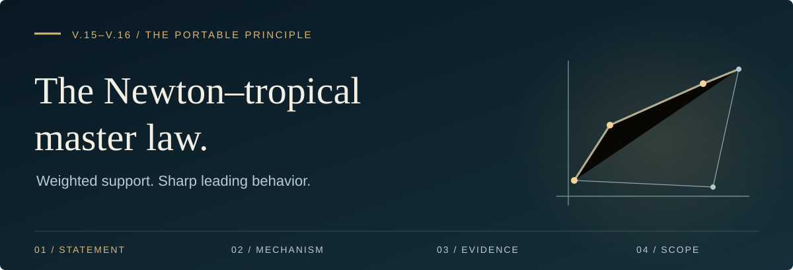
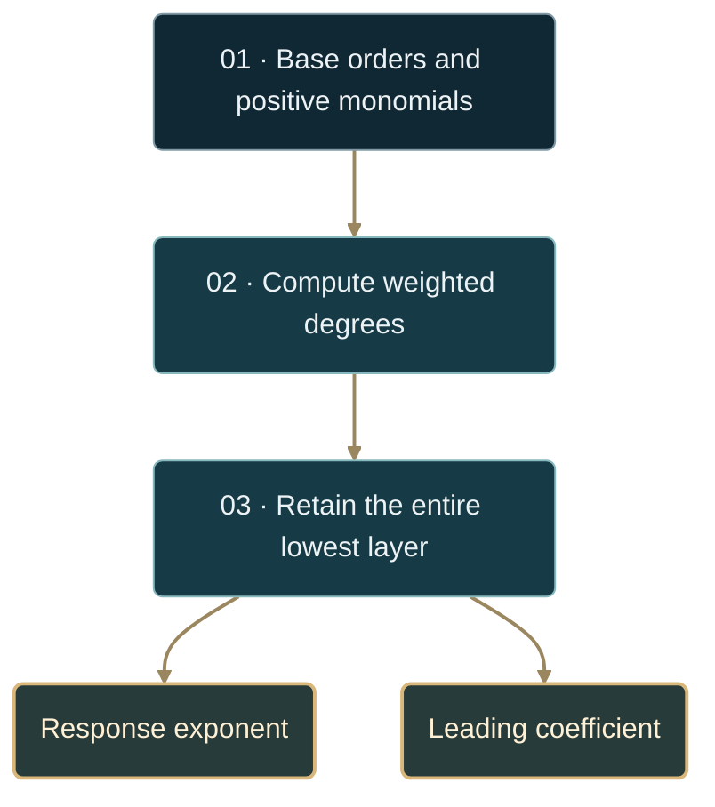

# The Newton–tropical master law

**V.15 · sharp constant** / **V.16 · selection**

[**Read the law →**](#theorem-v16) · [Sharp constant](#theorem-v15) · [Numerical scope](#implementation-and-evidence) · [Reproduce](#reproduce) · [Shared architecture](../README.md#the-three-layer-selection-principle)

| 01 · Orthant | 02 · Polyhedron | 03 · Parameters | 04 · Execution |
| :--- | :--- | :--- | :--- |
| **This theorem** | [Feasible-face selection](FORMAL_FACE_SELECTION.md) | [Qualified stratification](FORMAL_QUALIFIED_SELECTION_STRATIFICATION.md) | [Backend contract](FACE_SELECTION_BACKEND.md) |

The flatness of the base assigns a weight to each perturbation monomial. The
least weight determines the response exponent; the entire tied lowest layer
determines the leading coefficient. This note states that rule for a finite
sum with **fixed positive coefficients**, then derives the sharp constant.



---

## Setting and scope

Place the corner at the origin in inward coordinates $x_i\ge0$. Write

$$
\begin{aligned}
Q(x)&=\sum_{i=1}^n A_i x_i^{\beta_i},
&A_i&\gt0,\quad \beta_i\gt1,\cr
P(x)&=\sum_{j=1}^N\gamma_j\prod_i x_i^{\alpha_{ij}},
&\gamma_j&\gt0,\quad \alpha_{ij}\ge0,\cr
f_s(x)&=-Q(x)+sP(x),&s&\downarrow0.
\end{aligned}
$$

Each monomial is nonconstant, so $P(0)=0$. All orders and coefficients are
fixed as $s\downarrow0$. Noninteger nonnegative exponents are allowed here;
the ambient polynomial compiler has its separate polynomial input contract.

Define $\Delta(s)=\max f_s$ on a fixed compact orthant neighborhood of the
origin, such as $\lbrace x\ge0:Q(x)\le\rho\rbrace$ with $\rho\gt0$.
The base has its unique maximum at zero, so maximizers localize there.

> [!IMPORTANT]
> The unrestricted orthant maximum also requires control at infinity. It is
> valid for the positive finite model when all weighted degrees are at most
> one and $s$ is sufficiently small. A positive term of degree greater than
> one makes the unrestricted supremum infinite. Use the compact local model
> in that case. Signed coefficients require the separate
> [qualified-face theorem and upper envelope](FORMAL_FACE_SELECTION.md#6-upper-control-on-unqualified-faces).

<a id="theorem-v15"></a>

## Theorem V.15 — the sharp single-axis constant

For $A,\gamma\gt0$ and $0\lt\alpha\lt\beta$, the exact model
$-Ax^\beta+s\gamma x^\alpha$ on $x\ge0$ has

$$
\boxed{\Delta(s)=Cs^p,\qquad p=\frac{\beta}{\beta-\alpha},}
$$

$$
\boxed{
C=\gamma\frac{\beta-\alpha}{\beta}
\left(\frac{\gamma\alpha}{A\beta}\right)^{\alpha/(\beta-\alpha)}.}
$$

On a fixed compact interval containing zero, the same equality holds once
the optimizer lies inside the interval. Uniformly controlled higher-order
remainders give the corresponding asymptotic law $\Delta(s)\sim Cs^p$.

<details>
<summary><strong>Read the proof</strong> · one stationary balance</summary>

For $\varphi_s(x)=-Ax^\beta+s\gamma x^\alpha$, stationarity gives

$$
x_s=\left(\frac{s\gamma\alpha}{A\beta}\right)^{1/(\beta-\alpha)}.
$$

The derivative has the sign of $s\gamma\alpha-A\beta x^{\beta-\alpha}$:
it is positive before $x_s$ and negative afterwards. Thus $x_s$ is the
global maximum. Using $Ax_s^\beta=(s\gamma\alpha/\beta)x_s^\alpha$,

$$
\varphi_s(x_s)=s\gamma\left(1-\frac\alpha\beta\right)x_s^\alpha=Cs^p.
$$

For a remainder extension, localization, a uniform upper bound, and uniform
convergence under this rescaling are required; a pointwise expansion alone
does not justify maximizing it. $\square$

</details>

### Independent axes add

For a separable exact model with one subcritical monomial per axis,

$$
\Delta(s)=\sum_i C_i s^{p_i},\qquad
p=\min_i p_i,\qquad C=\sum_{i:p_i=p}C_i.
$$

Only axes whose exponents tie contribute to the **leading** coefficient.
For a general polyhedral neighborhood this separable identity is local,
valid once the independently optimizing coordinates are feasible.

| $\alpha$ | $\beta$ | $\gamma$ | $A$ | $p$ | $C$ |
| :--- | :--- | :--- | :--- | :--- | :--- |
| $1$ | $2$ | $3/4$ | $1$ | $2$ | $9/64$ per axis; $9/32$ for two equal axes |
| $1$ | $2$ | $1$ | $1$ | $2$ | $1/4$ |
| $1/2$ | $2$ | $1$ | $1$ | $4/3$ | $3/4^{4/3}\approx0.472470$ |
| $1$ | $3$ | $1$ | $1$ | $3/2$ | $2/(3\sqrt3)\approx0.384900$ |

<a id="theorem-v16"></a>

## Theorem V.16 — selection by the lowest weighted layer

Let

$$
q_j=\sum_i\frac{\alpha_{ij}}{\beta_i},\qquad
q_\ast=\min_j q_j,
$$

and assume $0\lt q_\ast\lt1$. Let $W$ contain **all** terms attaining this
minimum. Then

$$
\boxed{\Delta(s)\sim Cs^p,\qquad p=\frac1{1-q_\ast},}
$$

where

$$
\begin{aligned}
B&=\max_{z\ge0,\ Q(z)=1}W(z),\cr
C&=(1-q_\ast)q_\ast^{q_\ast/(1-q_\ast)}B^{1/(1-q_\ast)}.
\end{aligned}
$$

In particular, $\Delta(s)=\Theta(s^p)$. The selected support is the lowest
face of the perturbation's Newton polytope under weights $(1/\beta_i)$.
Terms of greater degree affect the remainder and the finite-scale behavior.

<details>
<summary><strong>Read the proof</strong> · compact directions and a uniform rescaling</summary>

Set $\delta_t z=(t^{1/\beta_i}z_i)_i$. On the compact section $Q(z)=1$,
each monomial is bounded, and

$$
P(\delta_tz)=t^{q_\ast}W(z)+\sum_{q_j\gt q_\ast}
\gamma_jt^{q_j}z^{\alpha_j}.
$$

For $0\lt t\le1$, this gives $P(x)\le KQ(x)^{q_\ast}$ uniformly.
Localization reduces the compact problem to this range. At a maximizer
with positive gain,

$$
0\lt-Q(x)+sP(x)\le-Q(x)+sKQ(x)^{q_\ast},
$$

so $Q(x)\le(sK)^p$. Put $x=\delta_{s^p}y$. The maximizing $y$ therefore
lies in a fixed compact set, and uniformly there,

$$
s^{-p}f_s(\delta_{s^p}y)
=-Q(y)+W(y)+\sum_{q_j\gt q_\ast}
\gamma_js^{p(q_j-q_\ast)}y^{\alpha_j}
\longrightarrow-Q(y)+W(y).
$$

Every fixed $y$ is feasible after rescaling for sufficiently small $s$.
Uniform convergence on the bounded maximizing set identifies the limiting
maximum. On $Q(z)=1$, maximizing $-t+t^{q_\ast}W(z)$ over $t\ge0$ gives
$(1-q_\ast)q_\ast^{q_\ast/(1-q_\ast)}W(z)^p$.
Maximizing over $z$ proves the formula. Positivity of the coefficients gives
$B\gt0$, hence $C\gt0$. $\square$

</details>

The equivalent projective expression is

$$
C=\frac{1-q_\ast}{q_\ast}q_\ast^p
\left[\max_{z\ge0,\ z\ne0}\frac{W(z)}{Q(z)^{q_\ast}}\right]^p.
$$

This is an exact variational formula. It need not have a closed-form
evaluation for a coupled $W$.

## What superposition preserves

For positive finite sums, the weighted order obeys

$$
q(P_1+P_2)=\min\lbrace q(P_1),q(P_2)\rbrace,\qquad
q(P_1P_2)=q(P_1)+q(P_2).
$$

These are the tropical operations on **weighted order**. The response
exponent is obtained afterwards through $p=1/(1-q)$. The least weight wins;
when several terms tie, their **sum** determines $C$.

Positive amplitudes do not change the asymptotic exponent while the support
is fixed. They do change the coefficient and the scale at which the leading
law is accurate. For example, against $Q=x^2$,

$$
P(x)=100x+0.001\sqrt{x}
\quad\Longrightarrow\quad
q_\ast=\frac14,\qquad p=\frac43.
$$

<details>
<summary><strong>Inspect the slow crossover</strong> · a finite-scale numerical example</summary>

The measured two-point slopes of the full mixed model are:

| Strength interval | Log-log slope |
| :--- | :--- |
| $10^{-2}\to10^{-4}$ | $2.000$ |
| $10^{-4}\to10^{-6}$ | $1.999$ |
| $10^{-6}\to10^{-8}$ | $1.995$ |
| $10^{-8}\to10^{-10}$ | $1.951$ |
| $10^{-10}\to10^{-12}$ | $1.742$ |

These values can be computed by setting $t=\sqrt{x}$ and finding the unique
positive root of $4t^3-200st-0.001s=0$. At that root,
$\Delta(s)=50st^2+0.00075st$. They are numerical diagnostics, not a tolerance
certificate. Equating the two *isolated* gap laws gives approximately
$s=2.59808\times10^{-12}$; it does not certify accuracy for their mixture.

</details>

The earlier exponent laws are recovered within their matching assumptions:

| Base and perturbation | Weight | Response exponent |
| :--- | :--- | :--- |
| $x^2$ and $x$ | $1/2$ | $2$ |
| $x^\beta$ and $x^\alpha$ | $\alpha/\beta$ | $\beta/(\beta-\alpha)$ |
| $x^2+y^6$ and $\sqrt{xy}$ | $1/4+1/12=1/3$ | $3/2$ |

## Implementation and evidence

The mathematical constant is sharp; the numerical API has a more specific
contract. [The module](../categorical_polytope/newton_tropical.py) uses
floating-point arithmetic and assumes the stated positive-input model.
It is not a general signed-perturbation validator.

| Entry point | What it computes | Evidence limit |
| :--- | :--- | :--- |
| `sharp_gap_constant` | Single-axis $(p,C)$, including a supplied $A$ | Closed formula evaluated in floating point |
| `newton_tropical_face` | Minimum degree and tied support | Floating degree comparisons with a tolerance |
| `tropical_gap_leading` | Leading gap for base coefficients $A_i=1$ | Separable formula or numerical coupled optimization |
| `orthant_gap` | Multistart numerical maximization | Diagnostic search, without a certified global error bound |

The `exact` Boolean from `tropical_gap_leading` distinguishes its separable
closed-form branch from its numerical coupled branch. It does not mean exact
rational arithmetic or exact finite-scale accuracy for a model containing
higher layers. The coupled search is not a proof that the variational maximum
was attained globally.

V.15 supplies constants for the stated power models. Extending an older
$\Theta$ result to a sharp asymptotic requires its own leading model and
uniform remainder justification; this note does not upgrade every earlier
theorem automatically.

## Reproduce

Run from the repository root:

```bash
python -m categorical_polytope.newton_tropical
python -m pytest -q -p no:cacheprovider tests/test_newton_tropical.py
```

The [tests](../tests/test_newton_tropical.py) compare formulas and selected
examples against numerical maximization. The proofs above supply the
mathematical justification within the stated scope.

---

[Continue to feasible-face selection →](FORMAL_FACE_SELECTION.md) · [Full reproduction runbook](RUNBOOK.md) · [Revision record](PRINCIPLE_DOCUMENTATION_REVIEW.md)
