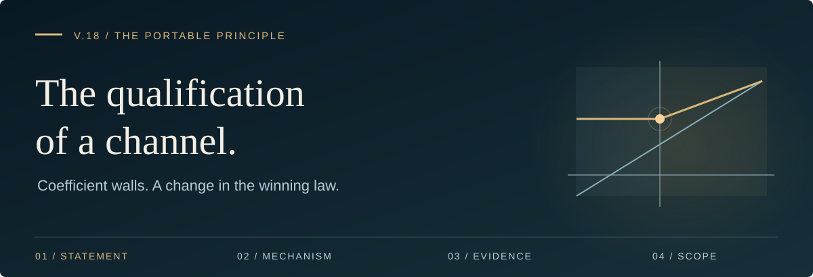
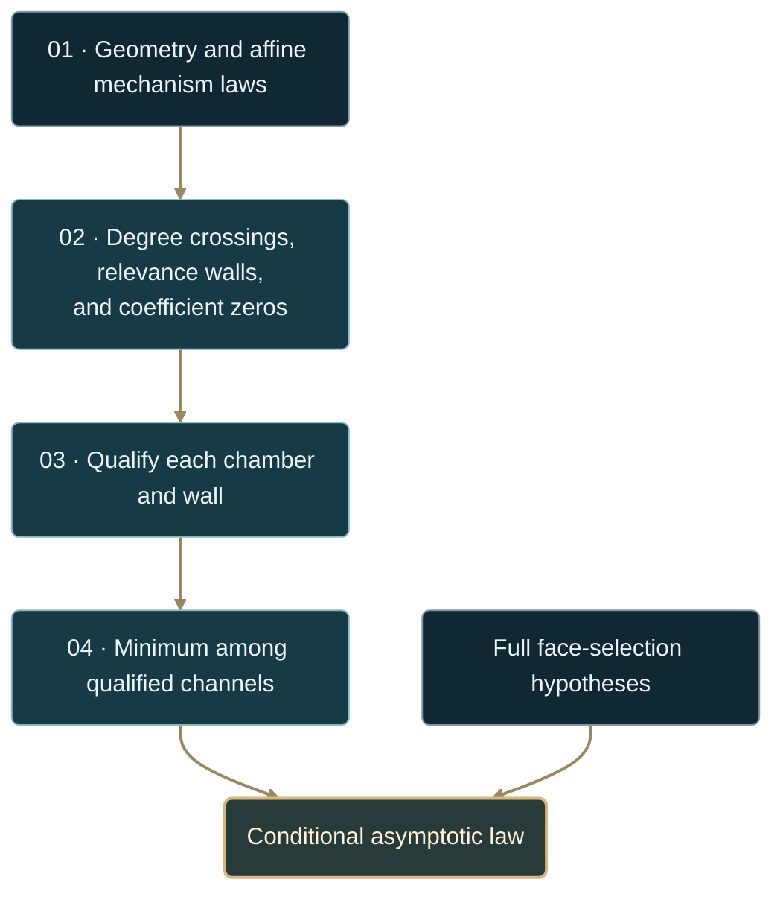

# The stratified qualified-selection law

**V.18** · current backend asset `portable-principle.v8` · exact affine phase algebra

[**Read the theorem →**](#theorem-v18--stratified-qualified-selection) · [Cancellation example](#worked-cancellation-driven-transition) · [Certificate](#machine-readable-qualification-certificate) · [Reproduce](#reproduce)

| 01 · Orthant | 02 · Polyhedron | 03 · Parameters | 04 · Execution |
| :--- | :--- | :--- | :--- |
| [Newton–tropical law](FORMAL_NEWTON_TROPICAL.md) | [Feasible-face selection](FORMAL_FACE_SELECTION.md) | **This theorem** | [Backend contract](FACE_SELECTION_BACKEND.md) |

## Abstract

A channel can disappear by cancellation, become non-positive, or become
positive and enter the competition without its degree crossing another
degree. V.18 adds these **qualification walls** to the degree-order walls
of [V.17](FORMAL_FACE_SELECTION_PHASE_FAN.md).

For a finite list of supplied mechanisms, qualification depends on geometry,
the combined coefficient, and weighted degree. It never depends on an
observed response exponent.



> [!IMPORTANT]
> The finite wall calculation is exact for the supplied mechanism list.
> A law for an underlying objective additionally requires a faithful list of
> face initial forms, positivity evidence, localization, and the corrected
> positive-gain upper envelope. A list of arbitrary positive terms is not
> automatically a list of qualified face mechanisms.

---

## Theorem V.18 — stratified qualified selection

Let $\theta\in[L,U]$ and let $J$ be finite. Each mechanism has a fixed
geometric admission flag and affine laws

$$
q_j(\theta)=a_j+b_j\theta,\qquad
c_j(\theta)=u_j+v_j\theta.
$$

Define

$$
\mathcal Q(\theta)=
\lbrace j:F_j\text{ admitted},\
c_j(\theta)\gt0,\
0\lt q_j(\theta)\lt1\rbrace.
$$

When $\mathcal Q(\theta)\ne\varnothing$, set

$$
q_\ast(\theta)=\min_{j\in\mathcal Q(\theta)}q_j(\theta),\qquad
\gamma(\theta)=\frac1{1-q_\ast(\theta)}.
$$

### Finite algebraic conclusion

Partition $[L,U]$ at the isolated roots of

$$
q_i=q_j,\qquad q_i=0,\qquad q_i=1,\qquad c_i=0.
$$

Identities add no isolated wall: identical degree laws remain tied, and an
identically zero coefficient remains cancelled. Endpoints and all wall
points are evaluated separately.

On each remaining open chamber:

- coefficient signs and degree relevance classes are constant;
- the qualified set and the ordering of nonidentical degree laws are constant;
- the winning mechanism set, including persistent ties, is constant;
- if that set is nonempty, $q_\ast$ is affine and $\gamma=1/(1-q_\ast)$.

The **winning identities** stay fixed within a chamber. The numerical value
of the exponent can vary continuously there. An empty qualified set has no
selected degree or exponent under this rule.

### Conditional asymptotic conclusion

To apply this selection to a family of optimization problems, also require:

| Hypothesis | Required meaning |
| :--- | :--- |
| Fixed geometry | Tangent-cone geometry and face incidence are fixed on the stratum |
| Valid initial forms | Each supplied channel is a face's first nonzero weighted layer, or an independently justified reduction of one; like terms have been combined |
| Positivity | A positive coefficient certifies the represented monomial or like-monomial initial form; general signed forms need separate evidence |
| Complete competing data | Every potentially winning qualified face, including any layer exposed at a wall, is represented or independently excluded |
| Analytic scope | Local base maximality, uniform principal remainders, global isolation, and the [positive-gain envelope](FORMAL_FACE_SELECTION.md#6-upper-control-on-unqualified-faces) hold where a consequence is asserted |

Then, for each fixed eligible $\theta$,

$$
\boxed{\Delta(s;\theta)=
\Theta\left(s^{1/(1-q_\ast(\theta))}\right)
\qquad(s\downarrow0).}
$$

The constants may depend on $\theta$. A uniform estimate on a parameter set
requires uniform analytic bounds and a uniformly positive lower witness
there. It is not automatic on a whole open chamber approaching a cancellation
wall.

<details>
<summary><strong>Read the proof</strong> · affine signs, followed by the conditional face theorem</summary>

Between consecutive roots, the signs of $c_j$, $q_j$, $1-q_j$, and
$q_i-q_j$ cannot change. Fixed geometric admission therefore makes
$\mathcal Q$ and its argmin constant. A winner supplies the affine formula
for $q_\ast$.

Under the additional geometric and analytic hypotheses, the
[corrected face-selection theorem](FORMAL_FACE_SELECTION.md#8-selection-qualified)
gives matching upper and lower bounds at each fixed parameter. At $c_j=0$,
the represented layer vanishes and is removed before selection. Any
replacement layer must already be represented or supplied through a separate
stratum; the affine engine does not derive it from an omitted polynomial.
$\square$

</details>

## Worked cancellation-driven transition

Consider

$$
q_A=\frac14,\quad c_A(\theta)=\theta-\frac13,\qquad
q_B=\frac12,\quad c_B=1,\qquad 0\le\theta\le1.
$$

| Parameter | Channel $A$ | Selected channel | $(q_\ast,\gamma)$ |
| :--- | :--- | :--- | :--- |
| $\theta\lt1/3$ | Non-positive | $B$ | $(1/2,2)$ |
| $\theta=1/3$ | Cancelled | $B$ | $(1/2,2)$ |
| $\theta\gt1/3$ | Positive | $A$ | $(1/4,4/3)$ |

The degrees never cross. The change comes entirely from qualification.

<details>
<summary><strong>See an objective realizing these mechanisms</strong> · an exact separable model</summary>

On $[0,1]^2$, take

$$
F(x,y)=-x^4-y^2,\qquad
G_\theta(x,y)=\left(\theta-\frac13\right)x+y.
$$

Writing $a_+(\theta)=\max(\theta-1/3,0)$, independent maximization gives

$$
\Delta(s;\theta)
=\frac{3}{4^{4/3}}a_+(\theta)^{4/3}s^{4/3}+\frac14s^2
$$

for $0\lt s\le2$ and $0\le\theta\le1$. The maximizers are
$x=(sa_+/4)^{1/3}$ and $y=s/2$.

When $\theta\le1/3$, $G_\theta\le y$ supplies the required upper control,
and $x=0$ realizes the exponent-2 channel. When $\theta\gt1/3$, both
coefficients are positive and the quartic axis sets the leading exponent.
Its leading coefficient tends to zero as the wall is approached, explaining
why a uniform leading-law accuracy claim across that approach would fail.

The backend example supplies the two mechanisms directly. It does not
reconstruct this objective from their affine degrees.

</details>

## Machine-readable qualification certificate

Each query classifies every supplied mechanism. The following order matches
the implementation when more than one exclusion could apply:

| Status | Meaning |
| :--- | :--- |
| `geometry_filtered` | The mechanism was not admitted |
| `non_positive` | Its supplied coefficient is negative |
| `cancelled` | Its supplied coefficient is exactly zero |
| `zero_weight` | $q\le0$ |
| `critical` | $q=1$ |
| `subleading` | $q\gt1$ |
| `qualified` | Admitted, positive, and $0\lt q\lt1$ |

An omitted coefficient uses the caller's fixed-positive-channel assumption.
Only `qualified` mechanisms enter the minimum. Inspect
`evaluations[].qualified_selection`, `winning_mechanisms`,
`weighted_degree`, and `response_exponent`. Exact rational strings are
retained beside display floats.

`robustness.parameter_distance` is the distance to the nearest **interior
transition of winning identities**, not a tolerance on the exponent or gap.
It is zero at a transition. With no interior transition it is `null`;
the mathematical distance is infinite. Endpoint behavior is checked
separately, and parameter perturbations must remain inside the domain.

## Scope boundary

Affine coefficient positivity decides a single monomial or a correctly
combined group of like monomials. It does not decide a general mixed-sign
initial form, nor justify skipping an earlier negative layer. Geometry
changes and unrepresented replacement layers require additional strata.

The current backend retains the v4 qualification capability within
`portable-principle.v8`. Its phase operation checks **caller-supplied
Boolean attestations**:

```json
{
  "fixed_admissibility": true,
  "coefficient_qualification_verified": true,
  "affine_degrees_verified": true,
  "uniform_local_base_maximality": true,
  "uniform_principal_remainder": true,
  "uniform_global_isolation": true
}
```

These belong inside the request's `assumptions` object. The phase operation
does not prove these assertions from a full objective. It also has no separate
attestation field or automatic check for the corrected positive-gain
envelope; that remains part of the mathematical evidence the caller must
supply. The default polynomial selector's v8 signed-layer guard is not run
on this abstract affine mechanism list.

Missing required flags produce `unlicensed` with named blockers while
retaining the exact algebraic diagram. A `licensed` phase response records
a conditional use of the declared model; it is not an independent proof of
the caller's analytic claims.

## Reproduce

Run from the repository root:

```bash
python -m categorical_polytope.adjudication.polyhedra.backend --input experiments/face_selection_qualified_v18_request.json --pretty
python experiments/reproduce_principle.py --only qualification phase-unlicensed
python -m pytest -q -p no:cacheprovider tests/test_face_selection_phase.py
```

The [saved request](../experiments/face_selection_qualified_v18_request.json)
evaluates $\theta=1/4,1/3,1/2$ and returns exponents $2,2,4/3$.
The separate `phase-unlicensed` control removes the V.17 example's
assumption flags and checks that its algebraic wall survives without a license.

---

[Inspect the executable contract →](FACE_SELECTION_BACKEND.md) · [Exact phase implementation](../categorical_polytope/face_selection_phase.py) · [Revision record](PRINCIPLE_DOCUMENTATION_REVIEW.md)
