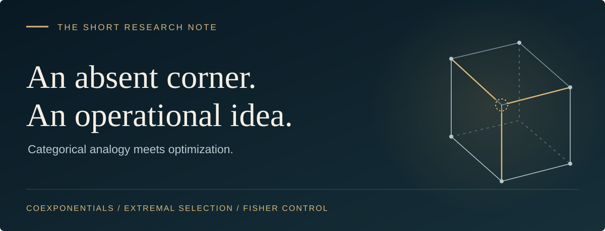
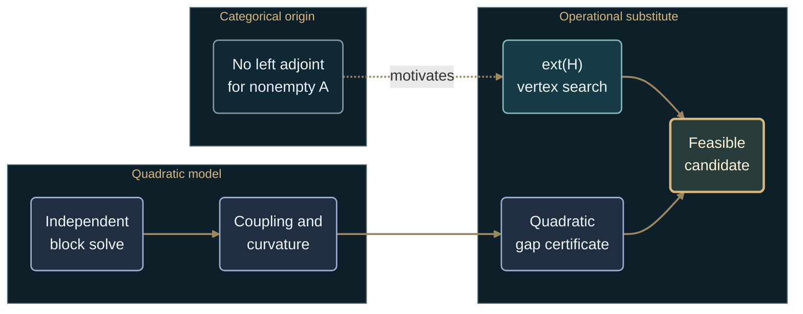

# Extremal Selection as an Operational Substitute for Coexponentials: Fisher-Controlled Factorization

**Brisen Koch · Short research note · Corrected edition, 7 September 2026**

[**Read the illustrated companion →**](../categorical_polytope/Overview.md) · [Full proofs](FORMAL_THEOREMS.md) · [Revision record](ORIGINAL_NOTE_REVIEW.md)

| 01 · The question | 02 · The connection | 03 · The guarantees | 04 · The evidence |
| :--- | :--- | :--- | :--- |
| [Abstract](#abstract) | [Conceptual map](#categorical--operational-map) | [Main results](#main-results) | [Reproducibility](#reproducibility) |

---

<sub>01 / THE QUESTION</sub>

## Abstract

For nonempty $A$, the coproduct functor $A\sqcup-$ on `Set` has no left
adjoint. This obstruction motivates an operational question: how can a
block-structured optimization problem produce a feasible candidate with a
verifiable objective guarantee? We organize three answers. A continuous
objective that is separately quasiconvex on a box attains its maximum at
some vertex. An exact positive-definite quadratic model admits a residual
identity and curvature-dependent error bounds. A finite candidate search is
certified by an upper bound on the same objective over the same feasible set.

These are conditional optimization results, not a construction of a
coexponential. This note develops the categorical and Fisher-controlled
origin of the project; its [Newton–tropical continuation](../README.md#the-three-layer-selection-principle)
studies a different question: which feasible face and weighted balance
govern a singular perturbation?

---

<sub>02 / THE CONNECTION</sub>

## Categorical ↔ operational map



The dashed arrow records motivation. The solid arrows organize computations
whose guarantees require the hypotheses below. In particular, an independent
block solve does not by itself imply small coupling.

<details>
<summary><strong>Read the correspondences precisely</strong></summary>

| Categorical idea | Operational interpretation |
| :--- | :--- |
| $A\sqcup-$ has no left adjoint when $A$ is nonempty | Motivation for a candidate-selection procedure |
| Cartesian products of feasible blocks | The actual set $H_A\times H_B$ used in the optimization model |
| Product–exponential adjunction in `Set` | Categorical background; it does not identify a numerical box corner |
| Geometric vertices | Extreme points of the feasible set, distinct from categorical limits and colimits |
| Block coupling | Off-diagonal terms of a specified quadratic model, assessed together with curvature |

**The obstruction in one step.** If a set $L$ represented
$\mathrm{Hom}(Y,A\sqcup-)$ for nonempty $A,Y$, evaluation at a singleton
$1$ would give a bijection between the single map $L\to1$ and at least two
constant maps $Y\to A\sqcup1$. The degenerate cases are stated in the
[full proof](FORMAL_THEOREMS.md#0-the-categorical-obstruction-and-the-analogy).

</details>

---

<sub>03 / THE GUARANTEES</sub>

## Main results

**1 · Where to search.** If the full objective $C$ is continuous and
separately quasiconvex on a compact box $H$, then

$$
\max_H C=\max_{v\in\mathrm{ext}(H)}C(v).
$$

At least one maximizing vertex exists. The claim is about the full objective;
separate assumptions on summands do not suffice.
[Theorem 1 and proof →](FORMAL_THEOREMS.md#theorem-1--vertex-localization)

**2 · What separation costs.** For the exact model
$Q(\theta)=c^\top\theta-\tfrac12\theta^\top F\theta$ with $F\succ0$, any
candidate $z$ has residual $r_z=c-Fz$. With a proved spectral lower bound
$0\lt \mu\le\lambda_{\min}(F)$,

$$
\begin{aligned}
Q(F^{-1}c)-Q(z)&=\frac12r_z^\top F^{-1}r_z\cr
&\le\frac{\|r_z\|_2^2}{2\mu}.
\end{aligned}
$$

For the independent block solve $z_0=D^{-1}c$, where $D$ is the block-diagonal
part of $F$, the normalized coupling
$\rho=\|D^{-1/2}(F-D)D^{-1/2}\|_2\lt 1$ gives the bound

$$
Q(F^{-1}c)-Q(z_0)
\le\frac{\rho^2}{2(1-\rho)}c^\top D^{-1}c.
$$

Here the model's positive-definite quadratic curvature may be a Fisher
matrix when that identification is justified. A local Fisher estimate alone
does not certify an arbitrary nonlinear objective.
[Theorem 2 and corollaries →](FORMAL_THEOREMS.md#theorem-2--quadratic-residual-and-separation-bounds)

**3 · How to certify a candidate.** Select the best point $p$ in a nonempty
finite feasible candidate set. If $U\ge\max_P C$ is proved, then

$$
0\le\max_P C-C(p)\le U-C(p).
$$

A full vertex reference under Theorem 1, or the quadratic residual bound
under Theorem 2, can supply $U$. Candidate generation and certification costs
are counted separately.
[Theorem 3 and marginal-pruning bound →](FORMAL_THEOREMS.md#theorem-3--a-certified-finite-candidate-search)

## Decision rules

| Evidence available | Valid conclusion |
| :--- | :--- |
| Theorem 1 holds on the full box | Full vertex enumeration attains a global maximum |
| Feasible quadratic candidate and proved $\mu\gt 0$ | Compare its residual bound with the requested tolerance |
| Independent block solve and $\rho\lt 1$ | Use the stated separation bound, including its energy factor |
| Nonlinear objective or additional coupled constraints | Establish an applicable global upper bound or report an unresolved guarantee |

The earlier cutoffs $0.10$ and $0.25$ are legacy demonstration settings,
not universal accuracy thresholds.

---

<sub>04 / THE EVIDENCE</sub>

## Reproducibility

From the repository root, run the standard-library reproduction script:

```bash
python experiments/note_publication_check.py
```

It checks the worked examples with exact rational arithmetic, including
objective rescaling and an equality case for the separation bound.

| Worked example | Exact gap | Proved bound |
| :--- | :--- | :--- |
| One coordinate pass for $F=\left(\begin{smallmatrix}4&1\\1&4\end{smallmatrix}\right)$, $c=(4,4)$ | $3/40$ | $3/32$ |
| Independent block solve for the same model | $1/5$ | $1/3$ |
| Marginal-pruning example in the script | $2$ | $2$ |

<details>
<summary><strong>Implementation and experimental scope</strong></summary>

The reproduction script implements the corrected worked examples.
The older `formal_bounds.Phi` and `leakage_gap_bound` functions retain
the expression disproved in the [revision record](ORIGINAL_NOTE_REVIEW.md).
The legacy `certified` field in `FisherPrunedVertexSearch` concerns an
auxiliary quadratic comparison, while `probe_gap` records a separate
finite vertex-reference gap.

The [experiment report](EXPERIMENT_REPORT.md) records the older
demonstrations. A grid point that beats all box vertices disproves vertex
localization for that example; failure to find such a point does not prove
global optimality. The local finite-difference Hessian is a diagnostic.

</details>

## References and continuation

Full statements, proofs, and background references are collected in
[FORMAL_THEOREMS.md](FORMAL_THEOREMS.md#references).

| The companion | The expanded text | The continuation |
| :--- | :--- | :--- |
| [**Overview.md →**](../categorical_polytope/Overview.md) | [Corrected paper draft →](PAPER_DRAFT.md) | [Newton–tropical face selection →](../README.md) |
| The argument, implementation map, and publication materials | Scope, worked examples, and interpretation | The project's portable selection principle |

<details>
<summary><strong>Publication sources and title</strong></summary>

- [Full proof source](FORMAL_THEOREMS.md) · corrected mathematical statements.
- [Exact reproduction](../experiments/note_publication_check.py) · self-contained worked examples.
- [Revision record](ORIGINAL_NOTE_REVIEW.md) · superseded claims and their counterexamples.
- [Citation metadata](../CITATION.cff) · existing repository author, title, and URL.
- [Earlier LaTeX note](short_note.tex) · historical source, not synchronized with this corrected edition.
- [Face-selection build guide](BUILD_PDF.md) · for the separate `FORMAL_FACE_SELECTION.tex` manuscript.

```text
Extremal Selection as an Operational Substitute for Coexponentials: Fisher-Controlled Factorization
```

</details>
