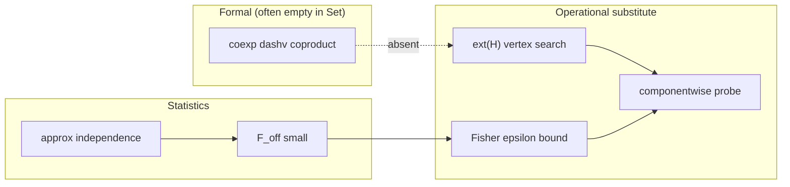

# Extremal Selection as an Operational Substitute for Coexponentials: Fisher-Controlled Factorization

**One-page note** — categorical analogy tied to statistical/optimization practice.

## Abstract

In `Set`, a formal coexponential (left adjoint to coproduct) does not exist: the natural isomorphism \(\mathrm{Hom}(\mathrm{coexp}(A,Y), Z) \cong \mathrm{Hom}(Y, A \sqcup Z)\) fails by cardinality. We propose an **operational substitute**: **extremal selection** on compact feasible polytopes plus **componentwise probes** on coproduct blocks, with **Fisher off-diagonal leakage** \(\varepsilon\) certifying when separable optimization is near-optimal. We give vertex localization (Theorem 1), a gap bound \(\Phi(\varepsilon)\) (Theorem 2), and a constructive probe algorithm (Theorem 3). A Python package reproduces toy experiments.

## Categorical ↔ operational map



| Categorical | Statistical / optimization |
|-------------|---------------------------|
| Coproduct \(A \sqcup B\) | Block partition of parameters |
| Coexponential | **Absent** in `Set` → extremal + probe |
| Product \(\dashv\) exponential (CCC) | Cartesian corner \((\lambda_{\max}, \ldots)\) |
| Limit / colimit vertices | \(\mathrm{ext}(H)\) |
| Naturality / cross terms | \(F_{AB}\), \(\varepsilon\) |

## Main results (informal)

1. **Vertex localization:** under separate monotonicity and axis quasiconvexity, \(\theta^\star \in \mathrm{ext}(H)\).
2. **Near-optimality:** \(C(\theta^\star) - C(\theta_{\mathrm{sep}}) \le \Phi(\varepsilon) \to 0\) as \(\varepsilon \to 0\).
3. **Constructive probe:** marginal vertex search + top-\(k\) Fisher pruning; certificate via \(\Phi\).

## Design rules

- \(\varepsilon \le 0.10\): use separable coproduct probe.
- \(0.10 < \varepsilon \le 0.25\): block coordinate ascent, verify gap.
- \(\varepsilon > 0.25\): joint solve or full \(\mathrm{ext}(H)\) search.

## Reproducibility

```bash
cd categorical_polytope
python -m categorical_polytope          # full demo
python experiments/run_experiments.py   # numerical firsts
python experiments/plot_results.py      # figure (needs matplotlib)
python -m unittest discover -s tests -v
```

**Figures for the note:**

- `experiments/figures/gap_vs_epsilon.png` — quadratic Fisher coupling
- `experiments/figures/nonlinear_face_bowl.png` — vertex localization breakdown

Run `python experiments/run_all.py` to generate.

## Strict certification

Theorem 2 certificate requires both \(\varepsilon \le \varepsilon_0\) and \(\text{gap} \le \Phi(\varepsilon)\). Large coupling fails certification even when vertex search succeeds.

See `docs/FORMAL_THEOREMS.md` for proof sketches and `README.md` for module map.

**Keywords:** coexponential, coproduct, Fisher information, extremal selection, vertex localization, quasiconvexity.
