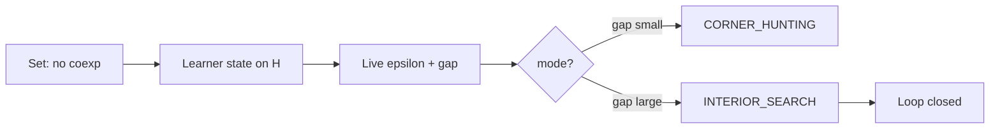

# Loop closure: live polytope probe while internalizing coexp failure

Coexp absent in Set (cardinality) -> learner raises confusion on the (lam,sigma) face -> live probe sees grid beating vertices -> INTERIOR_SEARCH closes the operational substitute loop.

**Backend:** scripted learner | **Closure at turn:** 4 | **Coupling coordinate:** measured

> Coupling was scored from the learner's own prose, not taken from its `confusion` field. Self-report sat 0.099 away on average (worst: turn 2, 0.159); it overclaimed on 8 turn(s) and underclaimed on 0.

## Timeline

| Turn | mode | epsilon | gap | reported | measured | topic |
|------|------|---------|-----|----------|----------|-------|
| 0 | CORNER_HUNTING | 0.0000 | 0.0000 | 0.050 | 0.043 | product_exp |
| 1 | CORNER_HUNTING | 0.0000 | 0.0000 | 0.120 | 0.036 | coproduct |
| 2 | CORNER_HUNTING | 0.0000 | 0.0000 | 0.220 | 0.061 | coexp_empty |
| 3 | CORNER_HUNTING | 0.0000 | 0.0082 | 0.350 | 0.224 | cross_natural |
| 4 | INTERIOR_SEARCH | 0.0000 | 0.0353 | 0.480 | 0.378 | face_interior |
| 5 | INTERIOR_SEARCH | 0.0000 | 0.0583 | 0.550 | 0.509 | interior_search |
| 6 | INTERIOR_SEARCH | 0.0000 | 0.0554 | 0.620 | 0.492 | adjoint |
| 7 | INTERIOR_SEARCH | 0.0000 | 0.0662 | 0.700 | 0.554 | closure |

**At closure:** "Maybe the true picture is interior on the face, not a corner."

## Turn detail

### Turn 0
- Facilitator: Turn 0: Where do you place product and curry on the diagram?
- Learner quote: Curry lives at the product corner — I'm comfortable there.
- Tutor: Probe: corner/separable OK. Learner: "Curry lives at the product corner — I'm comfortable there."

### Turn 1
- Facilitator: Turn 1: How do you read coproduct as a block?
- Learner quote: Coproduct is disjoint union; I probe each block at a vertex.
- Tutor: Probe: corner/separable OK. Learner: "Coproduct is disjoint union; I probe each block at a vertex."

### Turn 2
- Facilitator: Turn 2: What goes wrong with coexponential in Set?
- Learner quote: Coexponential in Set? I can't find a representing object.
- Tutor: Probe: corner/separable OK. Learner: "Coexponential in Set? I can't find a representing object."

### Turn 3
- Facilitator: Turn 3: Does cross-naturality couple your face coordinates?
- Learner quote: Cross-naturality mixes my lambda-sigma face — corners feel wrong.
- Tutor: Probe: corner/separable OK. Learner: "Cross-naturality mixes my lambda-sigma face — corners feel wrong."

### Turn 4
**LOOP_CLOSURE: coexp confusion + face coupling -> interior search**
- Facilitator: Turn 4: Is your maximum still on a corner of (lam,sigma)?
- Learner quote: Maybe the true picture is interior on the face, not a corner.
- Tutor: Probe: INTERIOR_SEARCH. Your report: "Maybe the true picture is interior on the face, not a corner." — corner-hunting is unsound; search the face interior.

### Turn 5
- Facilitator: Turn 5: The probe recommends a search mode — what do you do?
- Learner quote: I should search the interior; corner-hunting failed me.
- Tutor: Probe: INTERIOR_SEARCH. Your report: "I should search the interior; corner-hunting failed me." — corner-hunting is unsound; search the face interior.

### Turn 6
- Facilitator: Turn 6: How do adjoints change your diagram position?
- Learner quote: Adjoints reverse arrows — factorization is only approximate.
- Tutor: Probe: INTERIOR_SEARCH. Your report: "Adjoints reverse arrows — factorization is only approximate." — corner-hunting is unsound; search the face interior.

### Turn 7
- Facilitator: Turn 7: Summarize the closed loop: coexp, epsilon, corners vs interior.
- Learner quote: Coexp shadow + Fisher epsilon + interior search — the loop closes.
- Tutor: Probe: INTERIOR_SEARCH. Your report: "Coexp shadow + Fisher epsilon + interior search — the loop closes." — corner-hunting is unsound; search the face interior.

*Disclaimer: lam/sigma/b/k come from the learner's structured report (protocol); the coupling coordinate is scored from its prose against a fixed proposition ledger. Neither is read from transformer activations. The probe is the mathematical witness.*